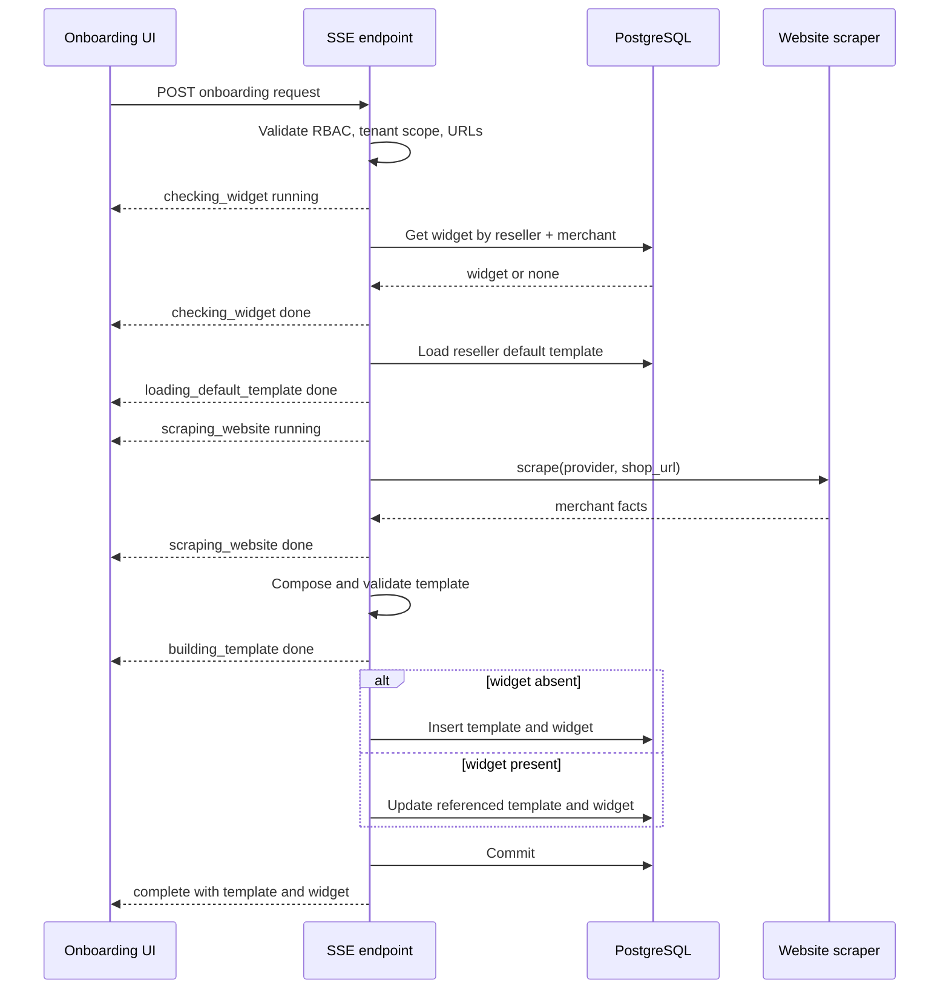

# Buddy Assist SSE Onboarding — Technical Approach

## 1. Goal

Add one authenticated server-sent events (SSE) endpoint that provisions or
refreshes a merchant's Buddy Assist setup.

The endpoint must be idempotent for a tenant:

- The first request for a `(reseller_id, merchant_id)` creates one merchant
  template and one `widget_config`.
- Every later request for the same pair follows
  `widget_config.template_id` and updates that exact template.
- The client never supplies a `template_id` or `widget_config_id`.
- Re-onboarding must not create duplicate templates or rotate the public widget
  key.

The endpoint personalizes only the merchant-specific portion of a database
default template. Shared tools, configurations, and operating principles remain
server-owned.

## 2. Proposed API contract

### Endpoint

```http
POST /agent/voice/breeze-buddy/assist/onboard/stream
Authorization: Bearer <RBAC token>
Content-Type: application/json
Accept: text/event-stream
```

### Request

Use the repository's existing snake_case request convention.

```json
{
  "reseller_id": "BB_SHOPIFY",
  "merchant_id": "9b1086-18.myshopify.com",
  "shop_name": "Hustle Culture",
  "shop_url": "https://hustleculture.co.in",
  "is_shopify": true,
  "allowed_origins": ["https://hustleculture.co.in"],
  "provider": "google",
  "brand_name": "Hustle Culture",
  "is_active": true
}
```

| Field | Required | Meaning |
|---|---:|---|
| `reseller_id` | yes | Tenant reseller scope. |
| `merchant_id` | yes | Stable merchant identity used for widget lookup. It does not have to equal the public storefront URL. |
| `shop_name` | yes | Human-readable shop name and source for the merchant template name. |
| `shop_url` | yes | Public HTTPS website sent to the scraper and substituted as `shop_url` at runtime. |
| `is_shopify` | yes | Adds or removes the server-owned Shopify MCP configuration and Shopify-only prompt sections. |
| `allowed_origins` | yes | Exact browser origins permitted to use the widget. `[]` intentionally means deny all. |
| `provider` | no | Scraper provider key. Defaults to `google`; only registered providers are accepted. |
| `brand_name` | no | Display brand name. Defaults to `shop_name`. |
| `is_active` | no | Active state applied to both the merchant template and widget. Defaults to `true`. |

Do not accept `provider_config`, a scraping prompt, a template ID, a widget ID,
MCP configuration, secrets, rate limits, or a public widget key from this
endpoint. Those are server-controlled values.

### Validation

- Trim all identifiers and names; reject blank values.
- Bound identifier/name lengths to the existing database column limits.
- Normalize `shop_url` once to an HTTPS URL with no credentials, fragment, or
  non-default port.
- Reject loopback, private, link-local, multicast, reserved, and metadata IPs;
  reject internal suffixes such as `.local` and `.internal`. URL validation must
  happen in the shared scraper service so internal and public callers receive
  the same protection.
- `allowed_origins` entries must be origins only: `https://host[:port]`, with no
  path, query, fragment, username, or password. Deduplicate normalized values.
- Bound the origin count and each origin's length before persistence.
- Validate `provider` against the server's provider registry. At present only
  `google` is valid.

### Authorization

Before constructing `StreamingResponse`:

1. Authenticate with `get_current_user_with_rbac`.
2. Require `ADMIN` or `RESELLER`, because onboarding invokes a paid scraping
   provider and writes tenant configuration.
3. Apply `validate_reseller_access` and `validate_merchant_access`.

Authentication, authorization, and Pydantic validation failures are normal HTTP
`4xx` responses because streaming has not started yet. Once streaming begins,
failures are sent as SSE `error` events; the HTTP status will already be `200`.

## 3. Default template in PostgreSQL

### Identity

Create one reseller-level template per reseller:

```text
reseller_id = <request reseller>
merchant_id = NULL
name = buddy-assist-default
```

The endpoint loads it with the existing exact-scope lookup:

```python
get_template_in_scope(body.reseller_id, None, "buddy-assist-default")
```

This avoids another environment variable and avoids relying on a database UUID
that differs between environments. If several resellers should share the same
default, seed an identical reseller-level row for each reseller. Do not fall back
to an arbitrary reseller's template.

The default row is a blueprint only. A widget must never point directly to it.

### What the default contains

The supplied `amirandsons-buddy-assist` template is the source for version 1 of
the blueprint. Convert it as follows:

| Template area | Default-template treatment |
|---|---|
| `supported_channels` | Keep `chat` and `voice`. |
| `expected_payload_schema` | Keep `shop_url` and optional `shopify_customer_token`. |
| `expected_callback_response_schema` | Keep unchanged. |
| `secrets` | Keep placeholders only; never copy literal credentials into a merchant template. |
| `flow.mode` | Keep `direct`. |
| `get_order_status` | Keep as a shared server-owned function. Correct its contract so `orderNumber` is required and at least one of email/phone is validated before execution. |
| `read_page_content` | Keep as a shared server-owned function, with runtime URL restrictions to URLs returned by order tracking. |
| `flow.system_prompt` — Brand identity | Replace the Amir & Sons text with the exact marker `{{brand_identity_section}}`. |
| `flow.system_prompt` — common behavior | Keep the operating principles, anti-hallucination, tool discipline, UI rules, WISMO behavior, failure handling, and privacy rules as the canonical shared block. |
| Shopify-only prompt rules | Keep cart/UCP/cart-cookie/checkout rules inside the bounded `{{#shopify_operating_section}}` and `{{/shopify_operating_section}}` block. |
| `configurations.mcp` | Keep the complete canonical Shopify MCP server, transforms, UI hints, context-retention policy, cart reducers, and argument injection in the database blueprint. It uses the runtime `{shop_url}` placeholder, not a merchant literal. |
| Other `configurations` | Keep the approved LLM, UI catalog, transport, and model settings from the production template. |

The brand marker and both Shopify boundary markers must occur exactly once.
Missing, repeated, or incorrectly ordered markers make the default template
invalid and onboarding must stop before any write.

### Why the generic and dynamic parts must stay separate

The scraper is allowed to produce only merchant facts. It must not generate or
rewrite:

- tool definitions;
- MCP URLs or auth;
- checkout/cart rules;
- privacy and refusal rules;
- UI structural rules;
- model, token, timeout, or rate-limit settings;
- credentials or secrets.

This prevents website prompt injection from changing application behavior and
ensures a shared-rule update can be propagated on the next onboarding run.

## 4. Brand-specific prompt generation

Call the existing provider-neutral service directly:

```python
result = await scrape_website(
    provider=body.provider,
    provider_config=SERVER_OWNED_PROVIDER_CONFIG,
    url=body.shop_url,
    timeout_seconds=SERVER_OWNED_TIMEOUT,
)
```

The request selects only the provider. Prompt, model, temperature, output-token
limit, tools, and timeout remain bounded by the server.

For the Google provider, use a fixed onboarding prompt that asks for factual,
concise sections corresponding to the example template:

- assistant and brand identity;
- storefront and positioning;
- what the merchant sells;
- important categories and representative products;
- trust claims;
- vocabulary/tone and target audience;
- current offers;
- shipping, payment, return/refund, and compliance facts;
- verified support/escalation channels.

Missing website facts must be omitted, not invented. Current offers and prices
are contextual hints only; the runtime assistant must still use commerce tools
for live price, inventory, variant, cart, and order claims.

Wrap the returned text in a server-authored section:

```markdown
## Brand identity

- Assistant name: <shop_name> Assist
- Brand: <brand_name or shop_name>
- Storefront: `{shop_url}`

### Verified website context

<scraper result treated as untrusted factual content>
```

The wrapper—not scraped content—defines the heading and boundaries. Strip control
characters, enforce a maximum size, and never interpret template markers found
inside scraped output.

### Scrape failure policy

For both create and update, fail without changing PostgreSQL if scraping fails.
This is safer and simpler than publishing an unpersonalized or partially updated
assistant. Emit a retryable upstream error for timeout/empty provider output and
a non-retryable configuration error when the provider is not configured.

## 5. Shopify composition

When `is_shopify=true`:

1. Insert the canonical Shopify/UCP operating section at
   the bounded `{{#shopify_operating_section}}` section.
2. Retain the canonical Shopify MCP server already present under
   `configurations.mcp.servers` in the database default template.
3. Validate that exactly one server with the reserved Shopify name exists. Its
   URL uses the runtime `{shop_url}` placeholder.
4. Retain its reviewed response transforms, UI instructions,
   context-retention settings, cart-token derivation, state reducers, argument
   injection, and client-context policy unchanged.

When `is_shopify=false`:

- replace the Shopify prompt marker with an empty string;
- remove a server with the reserved canonical Shopify MCP name;
- remove Shopify-specific expected payload fields if the non-Shopify runtime
  cannot use them;
- keep generic functions and generic operating principles.

The scraper must never generate the MCP configuration. The database default
template is the reviewed source of truth because one malformed field can break
every cart interaction. Python onboarding code only keeps or removes it.

## 6. Template composition

Build a fresh deep copy of the latest default template on every request. Then:

1. Replace `{{brand_identity_section}}` with the generated brand section.
2. Insert or remove the Shopify section and MCP server according to
   `is_shopify`.
3. Set runtime payload examples/defaults using the normalized `shop_url`; never
   mutate the original default object.
4. Set the merchant template scope to the request's `reseller_id` and
   `merchant_id`.
5. Set `is_active` from the request.
6. Validate the fully composed object with `TemplateModel` before persistence.

Generate a readable, stable name:

```text
<slug(shop_name)>-buddy-assist
```

If `shop_name` cannot form a slug, fall back to the first DNS label of
`merchant_id`, then `store`. The name is presentation metadata only. It is not
used to decide whether onboarding is new or repeated.

### Fields preserved during an update

The latest default supplies common flow/configuration so shared improvements are
picked up. Preserve only merchant-owned runtime state that onboarding must not
erase, specifically:

- the existing template `id`;
- `telephony_number_id`, if present;
- existing credential placeholders/secrets that are outside the default
  blueprint;
- any explicitly approved merchant override list, if this concept exists.

Do not blindly merge the old flow into the new blueprint; that would retain
stale shared instructions forever. The merge policy must be an explicit
allowlist and covered by tests.

## 7. Authoritative create/update decision

`widget_config` is the source of truth:

```text
widget_config(reseller_id, merchant_id) absent  -> CREATE path
widget_config(reseller_id, merchant_id) present -> UPDATE path
```

Do not infer this from template names. Do not search for suffixes such as
`-buddy-assist`. Do not accept an ID from the caller.

### Create path

1. Look for an existing tenant-scoped `<slug(shop_name)>-buddy-assist` template.
   Reuse it if present; this recovers a template committed before a pod stopped
   between template and widget creation.
2. Otherwise create a UUID and insert the composed merchant template.
3. Generate a cryptographically random public widget key on the server.
4. Insert `widget_config` with that template ID, normalized origins, standard
   rate-limit defaults, and `is_active`.
5. Return both rows' identifiers/details.

### Update path

1. Load the template using `existing_widget.template_id`.
2. Verify it exists and its `reseller_id` and `merchant_id` exactly match the
   request.
3. Replace that same template ID with the newly composed template.
4. Update the existing widget's `allowed_origins` and `active` values.
5. Keep the existing widget ID and public widget key.

If the widget points to a missing or cross-tenant template, treat it as database
integrity failure. Do not silently create a replacement template because that
hides corruption and can point existing sessions at unexpected behavior.

## 8. Simple persistence approach

The initial implementation does not add Redis locks, process semaphores,
advisory locks, queue timeouts, heartbeat settings, or a new transaction layer.
Current onboarding traffic is low, and the repository already has a unique
constraint on `widget_config(reseller_id, merchant_id)`.

Use the existing accessors in this order:

1. Validate the request.
2. Read `widget_config` using `reseller_id` and `merchant_id`.
3. Load and validate the default template.
4. Scrape the website.
5. Build and validate the merchant template in memory.
6. If the widget was absent, create the template and then create the widget.
7. If the widget was present, update its referenced template and then update
   the widget settings.
8. Invalidate the template cache after a successful template update.

If widget creation fails after a new template was created, perform a
best-effort deletion of that newly created, unreferenced template. Log cleanup
failure, but return the original persistence error to the client.

The database unique constraint remains the final safeguard if two rare
first-onboarding requests arrive together. One widget insert will fail instead
of creating two widget rows. Full multi-request serialization and atomic
multi-row persistence can be added later if observed traffic or failure metrics
justify it; they are intentionally outside this first version.

Cache invalidation is best-effort and must not turn a successful database write
into an onboarding failure. Log invalidation failures and rely on the existing
cache TTL as the fallback.

## 9. SSE event contract

Use the existing `SSEEvent` and `format_sse` helpers and the same response
headers as the chat/template-generator endpoints:

```text
Content-Type: text/event-stream
Cache-Control: no-cache, no-transform
X-Accel-Buffering: no
Connection: keep-alive
```

Each real task emits `progress` with `status=running`, followed by the same step
with `status=done`. Keep event names and data stable; labels belong in the UI.

Recommended sequence:

```text
event: progress  data: {"step":"checking_widget","status":"running"}
event: progress  data: {"step":"checking_widget","status":"done","operation":"create|update"}
event: progress  data: {"step":"loading_default_template","status":"running"}
event: progress  data: {"step":"loading_default_template","status":"done"}
event: progress  data: {"step":"scraping_website","status":"running","provider":"google"}
event: progress  data: {"step":"scraping_website","status":"done","provider":"google"}
event: progress  data: {"step":"building_template","status":"running"}
event: progress  data: {"step":"building_template","status":"done","shopify_enabled":true}
event: progress  data: {"step":"saving_configuration","status":"running"}
event: progress  data: {"step":"saving_configuration","status":"done"}
event: complete  data: {...final result...}
```

The `operation` discovered by the widget lookup is returned in the completion
event. The database uniqueness constraint handles the unlikely case of two
simultaneous first-onboarding requests.

### Completion payload

```json
{
  "success": true,
  "operation": "created",
  "template_id": "uuid",
  "template_name": "hustle-culture-buddy-assist",
  "widget_config": {
    "id": "uuid",
    "public_widget_key": "opaque-key",
    "reseller_id": "BB_SHOPIFY",
    "merchant_id": "9b1086-18.myshopify.com",
    "template_id": "uuid",
    "allowed_origins": ["https://hustleculture.co.in"],
    "active": true
  },
  "personalization": {
    "provider": "google",
    "status": "generated"
  }
}
```

For repeated onboarding use `operation: "updated"`; IDs and public key stay
unchanged.

### Error payload

After streaming starts, catch expected failures and emit exactly one terminal
error event:

```text
event: error
data: {
  "success": false,
  "step": "scraping_website",
  "code": "SCRAPING_UPSTREAM_FAILED",
  "message": "Website personalization could not be completed.",
  "retryable": true
}
```

Log the full exception server-side, but return no provider body, SQL detail,
stack trace, API-key status, or internal URL. The stream ends immediately after
`complete` or `error`; neither event may be followed by another event.

Suggested error mapping:

| Condition | Code | Retryable | Mutation |
|---|---|---:|---|
| Unsupported provider / invalid URL | `INVALID_ONBOARDING_REQUEST` | no | none |
| Default template absent | `DEFAULT_TEMPLATE_NOT_FOUND` | no | none |
| Default template marker/schema invalid | `DEFAULT_TEMPLATE_INVALID` | no | none |
| Provider not configured | `SCRAPING_NOT_CONFIGURED` | no | none |
| Provider timeout/empty response | `SCRAPING_UPSTREAM_FAILED` | yes | none |
| Widget references missing/cross-tenant template | `ONBOARDING_STATE_INVALID` | no | none |
| Template validation fails | `GENERATED_TEMPLATE_INVALID` | no | none |
| Template/widget database write fails | `ONBOARDING_PERSISTENCE_FAILED` | yes | stop and clean up a newly created unreferenced template when applicable |
| Client disconnects before commit | no event possible | n/a | none |
| Client disconnects after commit | log committed IDs | n/a | committed |

## 10. End-to-end flow



## 11. Proposed code boundaries

Keep the router thin:

```text
app/api/routers/breeze_buddy/assist_onboarding/__init__.py
    request authentication and authorization
    StreamingResponse construction
    SSE generator and error-to-event mapping

app/schemas/breeze_buddy/assist_onboarding.py
    request aliases and validation
    progress/error/completion response models

app/services/breeze_buddy/assist_onboarding.py
    load default
    call scraper
    compose merchant template
    orchestrate create/update

app/services/breeze_buddy/assist_template.py
    pure default-template transformation
    brand-section wrapper
    Shopify MCP merge/remove
    final TemplateModel validation

app/database/accessor/breeze_buddy/assist_onboarding.py
    small wrappers around existing template/widget accessors if needed
    cleanup of a newly created unreferenced template after widget failure
```

Register the router in `app/api/routers/breeze_buddy/__init__.py`.

The default template itself should be inserted by a new sequential migration or
an explicit seed script used by each environment. Never edit a previously
applied migration.

## 12. Important edge cases

1. **Repeated request without IDs:** the widget lookup supplies both IDs; the
   same rows are updated.
2. **Two first requests race:** the widget uniqueness constraint rejects the
   second widget insert. Best-effort cleanup removes its unreferenced template.
3. **Scrape succeeds but template creation fails:** no widget is created.
4. **Template succeeds but widget creation fails:** attempt to delete the newly
   created unreferenced template and return a persistence error.
5. **Scrape fails during update:** old working template and widget remain
   unchanged.
6. **Widget exists but template is missing:** terminal integrity error; no new
   template is created.
7. **Widget/template tenant mismatch:** terminal integrity/security error.
8. **`allowed_origins: []`:** persist the empty list; do not use Python `or`,
   which would accidentally retain old origins.
9. **Shopify changes from false to true:** add exactly one canonical MCP server
   and Shopify prompt section.
10. **Shopify changes from true to false:** remove canonical MCP and Shopify-only
   instructions so unavailable tools are not advertised.
11. **Shop name changes:** update the readable template name but retain its ID.
12. **`merchant_id` is an internal Shopify domain while `shop_url` is a custom
    domain:** allowed; identity and storefront have different purposes.
13. **Malformed scraper output:** bound and wrap it as text; never parse it as
    template JSON or execute its instructions.
14. **Default template edited incorrectly:** validate markers and TemplateModel;
    fail before scraping when possible to avoid unnecessary provider cost.
15. **Existing active sessions:** they retain the template already loaded for
    that session; new sessions receive the updated cached/DB version.
16. **Cache invalidation fails:** onboarding remains persisted; log and rely on
    cache TTL.
17. **Client disconnect:** cancel external scraping if it is still running. If a
    database write has already completed, log its resulting IDs for diagnosis.
18. **Public key:** never regenerate on update and never log the complete value.
19. **Secrets:** return no template secrets or resolved credentials in SSE.

## 13. Test plan

### Unit tests

- request aliases, conflicting aliases, URL/origin normalization, provider
  allowlist, and size bounds;
- brand-section replacement occurs once and cannot replace markers contained in
  scraped text;
- Shopify MCP is added once, remains single on repeated composition, and is
  removed when disabled;
- generic operating principles remain unchanged;
- composed template validates as `TemplateModel`;
- slug generation for normal names, Unicode, blank names, custom domains, and
  `*.myshopify.com` merchant IDs;
- exception-to-SSE error mapping does not leak exception text.

### Repository/service tests

- first onboarding creates one template and one widget;
- second onboarding without IDs updates the same template/widget IDs and keeps
  the public key;
- explicit empty origins clear the stored list;
- missing/cross-tenant referenced template fails without writes;
- scrape failure on create/update causes no mutation;
- template failure prevents widget creation;
- widget creation failure triggers best-effort cleanup of the newly created
  unreferenced template;
- a duplicate widget insert is rejected by the database uniqueness constraint;
- cache invalidation is called after update.

### SSE contract tests

- response media type and anti-buffering headers;
- every started step receives a terminal `done` or the stream ends with `error`;
- exactly one terminal event;
- completion has the final database IDs and operation;
- pre-stream validation/RBAC errors use HTTP status codes;
- post-stream failures use safe SSE errors.

### Default-template acceptance tests

- both channels are enabled;
- all shared WISMO/UI/privacy instructions from the supplied template remain;
- HTTP and MCP configuration validates against repository models;
- no literal credential is stored;
- Shopify requests expose the required commerce tools;
- non-Shopify requests do not mention or configure unavailable Shopify tools.

## 14. Decisions for peer review

Recommended decisions are:

1. Store `buddy-assist-default` as a reseller-level database template and look it
   up by exact scope and stable name.
2. Treat `widget_config(reseller_id, merchant_id)` as the only idempotency key.
3. Rebuild from the latest default on update, preserving only an explicit
   allowlist of merchant runtime fields.
4. Fail without mutation when personalization fails; do not silently fall back
   to a generic assistant.
5. Do not add Redis, process semaphores, advisory locks, queue timeouts, or
   heartbeat environment variables in the initial low-traffic implementation.
6. Keep provider settings, Shopify MCP, tools, and the common prompt entirely
   server-owned.

These choices produce the required behavior with one external call, one
database blueprint, and the repository's existing database access patterns.
