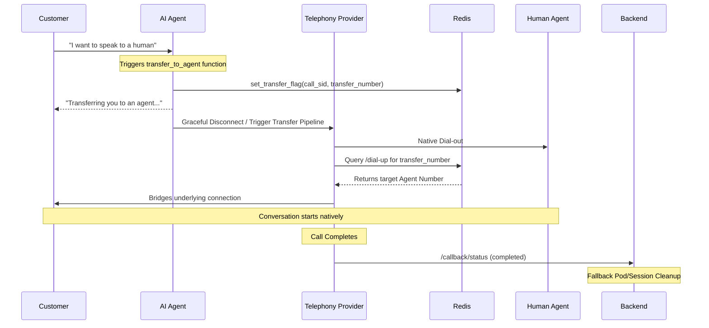

# Warm Transfer Example Template

This template demonstrates how to implement warm transfer functionality in Breeze Buddy voice agents.

## Overview

Warm transfer functionality orchestrates a complete handover of:

- The customer's live telephony call
- Automatic warm transfer to human agents
- Template-driven agent selection via Redis context
- Graceful fallback and error handling

## How Warm Transfer Works



### 1. Agent Selection (Automatic)

When a `transfer_to_agent` function is triggered from a template, the system:

- Extracts the `transfer_number` from the node hook's `expected_fields` payload (populated securely via dynamic template configuration).
- Sets a transfer flag in Redis (`set_transfer_flag`) with the `transfer_number`, `reseller_id`, `merchant_id`, and optional caller data.
- Readies the AI bot to gracefully exit the conversation so the transfer can execute.

### 2. Call Transfer Execution

Depending on the underlying telephony provider powering the call (`twilio`, `plivo`, `exotel`), the transfer is executed differently:

- **Twilio**: The customer is placed into a Twilio Conference. The system simultaneously dials the agent from the backend and drops them into the same conference.
- **Plivo**: Plivo's native `calls.transfer()` is used to redirect the customer leg to a `/dial-up` webhook, which natively fetches the target agent number from Redis and returns `<Dial><Number>` XML to bridge the calls together natively.
- **Exotel**: Exotel's flow (Applet) detects the AI disconnecting, proceeds to its next internal step, executes a REST call to our `/dial-up` webhook, reads the target agent plain-text number from Redis, dials it, and bridges the calls.

> [!NOTE]
> Deep technical documentation on exactly how each telephony provider bridges the call can be found in the `docs/warm-transfer/` directory.

### 3. Automatic Cleanup

For Twilio, cleanup of the isolated conference and isolated pod happen automatically. For Plivo and Exotel, the `/status` webhooks are utilized to trigger cleanup logic when the bridged call formally ends from the carrier side.

Redis transfer context flags automatically expire after a configurable TTL (e.g. 2 hours) ensuring no stale transfer bindings exist indefinitely.

## Prerequisites

Before utilizing warm transfer in a template, ensure your system template JSON is accurately provisioning the target `transfer_number` into the `transfer_to_agent` payload.

## Template Structure

### transfer_to_agent Function

```json
{
  "function_name": "transfer_to_agent",
  "description": "Call this when the customer explicitly asks to speak to a human or manager",
  "properties": {},
  "required": [],
  "hooks": [
    {
      "name": "update_outcome_in_database",
      "expected_fields": {
        "outcome": {
          "source": "static",
          "value": "TRANSFERRED_TO_AGENT"
        }
      }
    },
    {
      "name": "set_transfer_flag",
      "expected_fields": {
        "transfer_number": {
          "source": "context",
          "value": "custom_agent_transfer_number"
        }
      }
    }
  ],
  "post_actions": [
    {
      "type": "function",
      "handler": "warm_transfer"
    }
  ]
}
```

### Key Points

1. **`set_transfer_flag` hook**: This crucial hook saves the `transfer_number` state securely to Redis so the telephony provider webhooks can fetch it asynchronously when actively bridging the call.
2. **Post-action handler**: `warm_transfer` executes securely after hooks complete. This signals the AI bot and telephony logic to officially begin bridging the users.

## Failure Scenarios & Handling

### Invalid Target / No Target Configured

If no `transfer_number` is successfully cached and pulled:

```json
{
  "status": "failed",
  "reason": "agent_not_assigned",
  "message": "No support agents are available at this moment. Continuing with AI assistant."
}
```

- AI conversation dynamically continues.
- Customer is informed gracefully.

### Agent Join Timeout (Twilio)

If utilizing Twilio and the targeted agent doesn't successfully answer within the configured polling timeout threshold:

- Agent call leg is securely released.
- AI conversation continues seamlessly.

### Bridging Creation Failed

If the underlying provider API generally fails to enact the transfer:

```json
{
  "status": "failed",
  "reason": "conference_api_error",
  "error": "[error details]"
}
```

- Customer is maintained in the active session and gracefully returned back for error-based fallback.

## Integration Notes

### LLM Prompt Guidelines

The agent's system prompt should strictly adhere to:

1. Clearly stating when to legitimately transfer (explicit customer request/manager escalation).
2. Providing a static transition phrase explicitly before firing the transfer function.
3. NEVER suggesting transfers proactively.

Example from template directives:

```text
If the customer explicitly asks to speak with a human agent:
- Say: "I understand. Let me connect you to one of our support agents."
- Call the transfer_to_agent function immediately
- Do NOT continue conversation after calling this function
```

### Metadata Storage

On successful transfer, `lead.metaData` persists analytical tracking:

```json
{
  "transfer": {
    "status": "success",
    "provider": "plivo",
    "conference_id": "transfer-CA1234567890",
    "agent_call_id": "CA0987654321"
  }
}
```

This ensures accurate:

- Cleanup state polling on call completion.
- Telemetry, Analytics and reporting metrics.
- Debugging transfer flow progression issues.

## Monitoring & Debugging

You can observe successful transfer payloads and progression explicitly in standard application trace logs:

```text
[TRANSFER REDIS] Set flag for call CA123...: transfer_number=+1234567890
```

And tracked gracefully passing through the telephony provider's underlying dial-up webhooks:

```text
GET /agent/voice/breeze-buddy/plivo/callback/transfer/dial-up
Returned <Dial><Number>+1234567890</Number></Dial>
```
