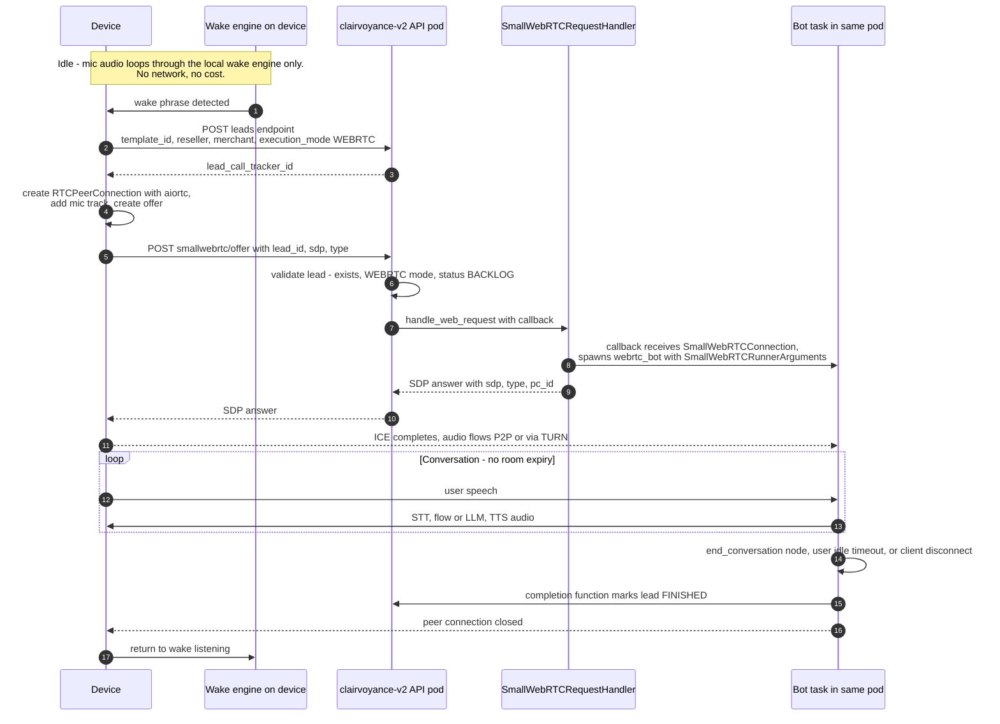
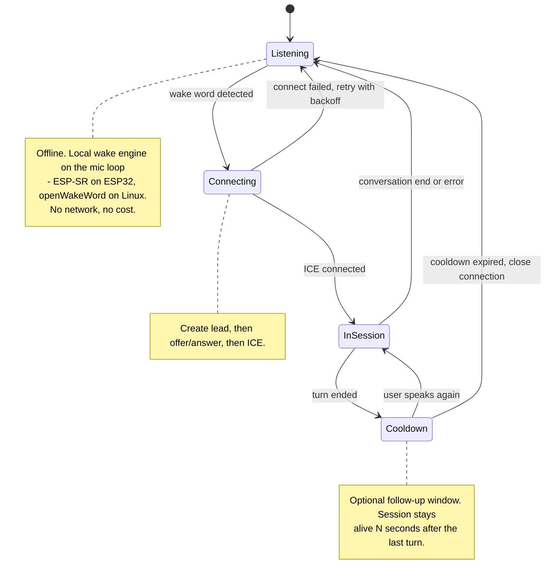
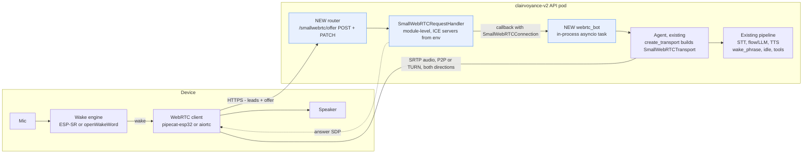

# SmallWebRTC Device Transport — Implementation Spec

**Goal:** add Pipecat's `SmallWebRTCTransport` (serverless P2P WebRTC, no Daily rooms, no 1-hour expiry) as a third voice transport in clairvoyance-v2, so always-on hardware devices (wake-word → converse → sleep) can talk to Breeze Buddy without Daily.

**Audience:** an implementing agent with zero prior context on this codebase. Every file path, line number, and API named here was verified against the repo and the installed `pipecat-ai==1.1.0` (`.venv/lib/python3.11/site-packages/pipecat/`) on 2026-07-15.

---

## 1. Why this is cheap: what already exists

The single most important fact: **the bot already constructs its transport through Pipecat's own dispatcher**, not hand-rolled Daily code.

- `app/ai/voice/agents/breeze_buddy/agent/__init__.py:462` — `self.transport = await create_transport(runner_args, transport_params)`
- `pipecat/runner/utils.py:560-568` (installed package) — `create_transport` **natively handles `SmallWebRTCRunnerArguments`**: it looks up `transport_params["webrtc"]` and returns `SmallWebRTCTransport(params=params, webrtc_connection=runner_args.webrtc_connection)`.
- Pipecat also ships a complete HTTP-side handler: `pipecat/transports/smallwebrtc/request_handler.py` — `SmallWebRTCRequestHandler` manages peer connections, offer/answer, ICE trickle (PATCH), connection reuse by `pc_id`, and even `esp32_mode` SDP munging for embedded clients.

So the work is: install the extra, add a `"webrtc"` transport-params entry, add a bot entry point, add an offer/answer HTTP endpoint, and audit the handful of Daily-only branches. No pipeline changes.

### Current state (verified)

| Thing | Where | State |
|---|---|---|
| Pipecat extras | `pyproject.toml:15` | `pipecat-ai[daily,google,assemblyai,silero,openai,azure,elevenlabs,aic,anthropic,deepgram,soniox,mcp,sarvam,cartesia]==1.1.0` — **no `webrtc` extra, `aiortc` not installed** |
| Transport factory | `agent/transport.py:104-176` `get_transport_params()` | keys: `daily`, `twilio`, `exotel`, `telnyx`, `plivo` — **no `webrtc`** |
| Transport constants | `agent/transport.py:29-30` | `TRANSPORT_TYPE_DAILY = "daily"`, `TRANSPORT_TYPE_TELEPHONY = "telephony"` |
| Bot entry points | `agent/__init__.py:1540` `telephony_bot`, `:1560` `daily_bot` | no webrtc entry |
| Daily connect API | `app/api/routers/breeze_buddy/daily/handlers.py:20` | validates lead → `start_daily_session` (room + tokens + bot) |
| Execution modes | `app/schemas/breeze_buddy/core.py:42` `ExecutionMode` | `DAILY`, `DAILY_TEST`, `DAILY_STREAM`, telephony modes — no WebRTC mode |
| Daily room expiry | `services/daily/daily.py:101-102` | `exp: now+3600`, `eject_at_room_exp: True` — the constraint we're escaping |
| Wake phrase (in-session) | `template/types.py:440` `WakePhraseConfig`; wired `agent/pipeline.py:364-382` | works, transport-agnostic, **not compatible with realtime/S2S LLM** (`template/utils.py:81-93` raises) |

---

## 2. Architecture

### End-to-end flow with SmallWebRTC



### Device runtime state machine



### Backend components (what gets added)



### Session lifecycle, leads, and cost reality — the model is ephemeral sessions, not a 24/7 connection

Removing the Daily 1-hour room cap does **not** mean sessions run indefinitely. The design is: the *device* is always-on (local wake engine, zero network cost); *sessions* are per-conversation, minutes long. Rationale, so nobody "optimizes" this away later:

- **Leads are single-use.** A lead is a call record, not a device identity: the offer handler only accepts `status == BACKLOG`, and completion marks it `FINISHED`. Every conversation = new lead. A device returning after 10 idle hours goes through wake → (pre-created) lead → offer, ~1–2 s total. The cooldown/follow-up window in the device state machine is 30–120 s, chosen only so follow-up questions don't need the wake word again.
- **Third-party connections are session-scoped.** A held-open session means the STT websocket streams (and bills) continuously — order of $0.35/audio-hour ≈ $250/month *per device* to transcribe silence — while STT vendors drop sockets after ~10 s without audio unless kept alive, TTS websockets idle-close and are reopened per utterance by Pipecat, and LLM context grows without bound over a never-ending conversation. None of these providers offer an "indefinite" mode worth building around.
- **Persistent sessions die in practice anyway.** Wi-Fi blips force ICE re-establishment; NAT mappings expire on idle UDP; every deploy kills live bots (`BOT_MAX_DRAIN_SECONDS = 25`, `app/core/config/static.py:474`); and one pinned bot process per device forever means server capacity scales with devices *sold*, not devices *talking*.
- **Fast reconnect ≠ persistence.** `SmallWebRTCRequestHandler`'s `pc_id` reuse covers short network interruptions within a conversation. It is not a mechanism for resuming after hours — don't build on it for that.

### Two hard architectural constraints — read before coding

1. **The bot MUST run in the same process as the offer endpoint.** `SmallWebRTCConnection` wraps a live in-memory `aiortc.RTCPeerConnection`; it cannot be serialized over stdin the way Daily bots are subprocess-spawned (`services/daily/daily.py:116-170`, `BB_DAILY_BOT_SUBPROCESS`). v1 uses the **legacy in-process pattern** (`asyncio.create_task` + the existing `_track_live_bot` strong-reference set, `daily.py:74-79`). Note the history: subprocess isolation was introduced to fix audio crackle from API event-loop stalls — so keep device concurrency low (config cap) and treat process isolation as a known v2 follow-up (child process would have to own both the offer handling and the PC).
2. **Media terminates on the pod that answered the offer.** With >1 replica you need sticky routing (same problem the telephony Smart Router solves — see comments in `app/api/routers/breeze_buddy/websocket.py:16-21`). For the pilot: run the webrtc router on a single replica or pin by session affinity. Do not silently deploy behind a round-robin LB.

Also: NAT traversal. P2P works on the same LAN / friendly NATs with STUN only; field devices behind carrier-grade NAT need a **TURN** server (coturn). ICE servers are configurable (Task 5) so this is deploy-time, not code-time.

---

## 3. Implementation tasks (backend, clairvoyance-v2)

### Task 1 — dependency: add the `webrtc` extra
`pyproject.toml:15`: add `webrtc` to the pipecat extras list →
`pipecat-ai[daily,google,assemblyai,silero,openai,azure,elevenlabs,aic,anthropic,deepgram,soniox,mcp,sarvam,cartesia,webrtc]==1.1.0`.
This installs `aiortc` (and its native deps: `libopus`, `libvpx` — verify the Docker base image has them; `Dockerfile` may need `apt-get install libopus0 libvpx7` or equivalents). Re-lock/reinstall, then verify: `python -c "from pipecat.transports.smallwebrtc.transport import SmallWebRTCTransport"`.

### Task 2 — constants + transport params
`agent/transport.py`:
- Line ~30: add `TRANSPORT_TYPE_WEBRTC = "webrtc"` (the string **must** be `"webrtc"` — it's the key `pipecat/runner/utils.py:561` looks up).
- In `get_transport_params()` (line 104), add a `"webrtc"` factory entry. Mirror the `"daily"` entry (line 128) but return a plain `pipecat.transports.base_transport.TransportParams` (SmallWebRTC takes generic `TransportParams`, not `DailyParams`): same 24 kHz in/out sample rates, `audio_in_enabled/audio_out_enabled=True`, same VAD analyzer / turn-taking config as daily, minus Daily-only fields (transcription, dial-in, etc.). Copy exactly what the daily lambda sets and drop anything that is a `DailyParams`-only kwarg.
- The AIC model-path helper `_get_aic_model_path` (line 33) branches on transport type — treat `TRANSPORT_TYPE_WEBRTC` like `TRANSPORT_TYPE_DAILY` (24 kHz).

### Task 3 — execution mode
`app/schemas/breeze_buddy/core.py:42` `ExecutionMode`: add
`WEBRTC = "WEBRTC"  # Device/embedded SmallWebRTC calls` (and `WEBRTC_TEST = "WEBRTC_TEST"` if test-mode parity with `DAILY_TEST` is wanted — recommended, the Agent reads test mode off the lead the same way).
Do **not** touch the daily handler's mode validation; the new webrtc handler validates its own modes.

### Task 4 — bot entry point + Daily-branch audit
`agent/__init__.py`:
- Add `webrtc_bot(runner_args, completion_function, aiohttp_session)` mirroring `daily_bot` (line 1560) but with `transport_type=TRANSPORT_TYPE_WEBRTC`. `Agent.run(runner_args)` will hit `create_transport` (line 462), which dispatches on the runner-args type — pass it a `pipecat.runner.types.SmallWebRTCRunnerArguments(webrtc_connection=conn)` with `.body = {"lead_id": ...}` set the same way `start_daily_session` builds `DailyRunnerArguments.body`.
- **Audit every `TRANSPORT_TYPE_DAILY` / `is_daily` branch** and decide per-site whether webrtc behaves like daily or is skipped. Known sites (grep for `TRANSPORT_TYPE_DAILY|is_daily|_setup_daily_transport`):
  - `:272` `is_daily` property — most consumers use it to mean "not telephony" (24 kHz, no provider serializer). Introduce an explicit `is_webrtc` and, where the intent is "not telephony", a `is_rtc = is_daily or is_webrtc` — do not blanket-redefine `is_daily`.
  - `:377` `_setup_daily_transport` — Daily keep-alive/room specifics: **skip** for webrtc.
  - `:639/:654/:1178` transfer/rebuild paths — warm transfer to a human agent joins a *Daily room*; for v1 declare human-transfer unsupported on webrtc (flow config for the device template should not include `transferring_to_human`) and raise a clear error if reached.
  - Recording: Daily cloud recording doesn't exist here. If recording is required later, Pipecat's `AudioBufferProcessor` is the path; out of scope v1.
- Completion: reuse `daily_completion_function` (`services/daily/daily.py:47` — it just updates the lead by `call_id == lead_id`, nothing Daily-specific). Consider renaming or aliasing (`lead_completion_function`) rather than importing "daily" into webrtc code.

### Task 5 — the offer/answer router (the only genuinely new code)
New package `app/api/routers/breeze_buddy/smallwebrtc/` (`__init__.py` + `handlers.py`), mounted in `app/main.py` next to the daily router (see `:313-315` for the prefix pattern — final paths `/agent/voice/breeze-buddy/smallwebrtc/...`; the path segment `smallwebrtc` is agreed with the device firmware team — do not rename unilaterally). RBAC-guard exactly like the daily router (`daily/__init__.py:23`).

Module-level handler (one per process):

```python
from pipecat.transports.smallwebrtc.request_handler import (
    SmallWebRTCRequestHandler, SmallWebRTCRequest, SmallWebRTCPatchRequest, ConnectionMode,
)
from pipecat.transports.smallwebrtc.connection import IceServer

_handler = SmallWebRTCRequestHandler(
    ice_servers=[IceServer(urls=u) for u in BB_WEBRTC_ICE_SERVERS],  # new config, see below
    connection_mode=ConnectionMode.MULTIPLE,
    # esp32 munging is PER-REQUEST (client sends client_type: "esp32"), not env:
    # a second, lazily-created handler with esp32_mode=True serves those requests
    # (host from the request's Host header, BB_WEBRTC_ESP32_HOST as LB override)
)
```

`POST /smallwebrtc/offer` — request body `{lead_id: str, sdp: str, type: str, pc_id?: str, restart_pc?: bool}`:
1. Validate the lead exactly like `daily/handlers.py:39-70`: exists (`get_lead_by_id`), `execution_mode in (WEBRTC, WEBRTC_TEST)`, `status == LeadCallStatus.BACKLOG`. Reject with the same 404/400 shapes.
2. Enforce a concurrency cap (new config `BB_MAX_CONCURRENT_WEBRTC_BOTS`, mirroring `BB_MAX_CONCURRENT_DAILY_BOTS`) using the size of the live-task set.
3. Call `await _handler.handle_web_request(SmallWebRTCRequest.from_dict(body), callback)` where the callback receives the `SmallWebRTCConnection` and spawns the bot **in-process**:

```python
async def _on_connection(conn) -> None:
    runner_args = SmallWebRTCRunnerArguments(webrtc_connection=conn)
    runner_args.body = {"lead_id": lead_id}
    session = create_aiohttp_session()
    task = asyncio.create_task(webrtc_bot(runner_args, daily_completion_function, session))
    _track_live_bot(task)   # reuse the strong-ref set pattern from services/daily/daily.py:74
```

4. Return the handler's answer dict (`{sdp, type, pc_id}`) to the caller.

`PATCH /smallwebrtc/offer` — forward to `_handler.handle_patch_request(SmallWebRTCPatchRequest(...))` for ICE trickle/renegotiation. Same auth. (Reconnect-with-`pc_id` reuses the live connection — that's built into `handle_web_request`.)

Shutdown: register `await _handler.close()` in the app lifespan teardown so PCs close on pod drain (drain budget: `BOT_MAX_DRAIN_SECONDS`, `app/core/config/static.py:474`).

### Task 6 — config
Add to the static/dynamic config modules (follow the `BB_*` pattern in `app/core/config/`):
- `BB_WEBRTC_ICE_SERVERS` (comma-separated, default `stun:stun.l.google.com:19302`; TURN URLs with credentials go here at deploy time)
- `BB_MAX_CONCURRENT_WEBRTC_BOTS` (int, small default e.g. 20 — in-process bots, see constraint #1)
- `BB_WEBRTC_ESP32_HOST` (str, default "" — OPTIONAL munging-host override for proxied/LB deployments; normally derived from the request's Host header. There is deliberately no esp32-mode env: munging is per-request via `client_type: "esp32"` in the offer body, since the same template serves both browser tests and devices)

### Task 7 — template config for the device
No code — operational. The device's template should set:
- `user_idle_handling`: either `enabled: false` or a generous `timeout` — this is what auto-ends a silent session (`template/types.py:574`; default 5 s × 3 retries is far too aggressive for an ambient device).
- `wake_phrase` (optional, in-session gating): `{enabled: true, phrases: ["hey buddy", ...], single_activation: false}` if the agent should only answer wake-prefixed turns *while connected*. **Must not** be combined with a realtime/S2S LLM (`template/utils.py:81-93` raises).
- `supported_channels` must include `voice`; no `transferring_to_human` node (Task 4).

### Task 8 — tests + local verification
- Unit: offer handler validation (404 missing lead, 400 wrong mode/status, cap exceeded), and a mocked-`SmallWebRTCRequestHandler` spawn test asserting the bot task launches with the right `lead_id`.
- Integration (manual, no device needed): Pipecat publishes a prebuilt browser client — `pip install pipecat-ai-small-webrtc-prebuilt` — or a ~40-line HTML page with `RTCPeerConnection` posting to `/smallwebrtc/offer`. A voice round-trip in the browser proves the whole backend before any hardware exists.
- Regression: one Daily call and one telephony call end-to-end must still pass untouched.

---

## 4. Device client (hardware repo — separate work stream, owned by the firmware team)

**Actual target hardware: ESP32-S3 running the official `pipecat-esp32` SDK**, which speaks SmallWebRTCTransport natively (one-shot SDP exchange over HTTP — exactly the endpoint in Task 5). Backend implications, agreed with the firmware team:

1. **ESP32 SDP munging is required, and the device must self-identify:** the firmware includes `client_type: "esp32"` in the offer body (top-level, alongside `lead_id`). The backend routes such requests through a `SmallWebRTCRequestHandler(esp32_mode=True, host=...)`, with `host` taken from the request's Host header (env override `BB_WEBRTC_ESP32_HOST` for proxied deployments). No env or template change is needed for future device types — each client declares itself.
2. **Wake layer lives in firmware:** on ESP32-S3 the wake engine is Espressif's ESP-SR/WakeNet (on-chip, offline) — not openWakeWord, which needs a Linux-class board. Same architecture either way: wake locally → session on demand.
3. **Lead creation and auth:** decide with the firmware team whether the ESP32 calls `POST /agent/voice/breeze-buddy/leads` directly (bearer token provisioned on the device; body identical to what the loom SDK sends — `packages/client-sdk/src/lib/client/api.ts:38` in loom-v2: `reseller_id, merchant_id, template_id, request_id, payload, execution_mode: "WEBRTC"`) or a thin proxy mints leads so the device only ever calls `/smallwebrtc/offer`. Latency trick either way: pre-create the *next* lead right after each session ends so wake → single offer call.
4. **RTVI events over the data channel are free:** `pipecat-esp32` consumes them natively (transcripts, conversation lifecycle) — the device can end on `conversation-end` instead of waiting for PC teardown.

**Reference client for backend testing without hardware** (also the fallback design for Linux-class devices): Python 3.11, ~300 lines — `openwakeword` (or Picovoice Porcupine) reading 16 kHz frames from `sounddevice` for wake, then `aiortc`: `RTCPeerConnection(configuration=...ice servers...)`, mic `MediaStreamTrack`, `createOffer()` → POST `/smallwebrtc/offer` → `setRemoteDescription(answer)`; play the remote track, watch `connectionstatechange`, tear down on `closed/failed/disconnected` and return to wake listening.

---

## 5. Effort estimate

| Work item | Scope | Estimate |
|---|---|---|
| Task 1-3: deps, constants, params, enum | mechanical, verified insertion points | 0.5 day |
| Task 4: `webrtc_bot` + Daily-branch audit | the audit is the real work — every `is_daily` site needs a decision | 1.5-2 days |
| Task 5-6: offer/PATCH router + config + lifespan | mostly delegating to `SmallWebRTCRequestHandler` | 1-1.5 days |
| Task 8: tests + browser-client round-trip | includes fixing what the round-trip exposes | 1-1.5 days |
| Docker/native deps (`aiortc` needs libopus/libvpx) + deploy flag, single-replica routing note | infra | 0.5-1 day |
| **Backend total** | | **~5-6.5 dev-days** |
| Device client: wake loop + aiortc + audio I/O + auth | pilot quality, one device | 3-4 days |
| TURN (coturn) deployment | only if devices sit behind hostile NAT | 0.5-1 day |
| **Pilot total** | | **~2 working weeks** |

Explicit v2 follow-ups (do NOT do in v1): per-call process isolation for webrtc bots; multi-pod sticky routing; human warm-transfer on webrtc; recording via `AudioBufferProcessor`; device fleet auth/provisioning.

---

## 6. Risks & gotchas checklist for the implementer

- [ ] `"webrtc"` params key is a magic string matched by `pipecat/runner/utils.py:561` — typo = `ValueError` at call time, not import time.
- [ ] `SmallWebRTCRunnerArguments.body` must carry `lead_id` — the Agent reads lead/template context from `runner_args.body` (see how `start_daily_session` builds it, `services/daily/daily.py`).
- [ ] In-process bots: watch for event-loop contention under load (the original "widget voice crackle" bug — `daily.py:120-127` comments). Keep `BB_MAX_CONCURRENT_WEBRTC_BOTS` small.
- [ ] aiortc native wheels: confirm the container base image; a missing libopus surfaces as an import error only when the extra is installed.
- [ ] Idle-timeout template default (5 s × 3) will kill device sessions mid-thought — Task 7 is not optional.
- [ ] Wake phrase config ≠ device wake word. Server wake_phrase gates turns *inside a live session* (STT still runs); the device's openWakeWord is what makes idle listening free. They compose; they don't substitute.
- [ ] Multi-replica deploys silently break ICE (answer from pod A, media to pod B) — pin to one replica until sticky routing exists.
- [ ] Daily/telephony regression suite must pass — every change in Task 4 touches shared Agent code.
