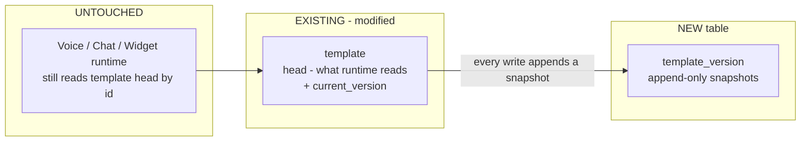
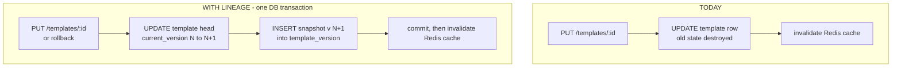

# Template Lineage — Architecture

**Status:** Implemented · **Owner:** Voice Platform · **Last updated:** 2026-08-13

Append-only **version history** for every Breeze Buddy template, and a safe
**rollback** on PROD, without losing any template's system prompt or
configuration.

---

## 1. Problem

Every voice/chat agent is a template (`template` table, one row each). Today:

- `PUT /templates/{id}` **overwrites the row in place** — there is no history. Once an edit lands, the previous state is gone forever.
- If a change misbehaves on PROD, there is **nothing to roll back to**.

What we verified about today's system (important for the design):

- The `template` row is the single source of truth at runtime. **Nothing snapshots it**: voice reads it from Postgres at call connect, chat/widget read it via a 60-second Redis cache on every turn.
- The **only writers** of the table are the templates REST endpoints. There is exactly one write path to intercept.

## 2. Concept

**Lineage** is the append-only version history of one template. Every write
becomes version N+1; old versions are never modified. It answers: *"What did
this template look like before? What can I roll back to?"*

Analogy: lineage is the commit log. Rollback is a `revert` (a new commit that
restores old content) — never history rewriting.

## 3. What we add (and what we don't touch)



**Runtime is untouched.** Calls, chat turns, and widget sessions keep reading the head row exactly as today. Versioning happens entirely on the write path.

### 3.1 Column added to the existing `template` table

| Column | Type | Purpose |
|---|---|---|
| `current_version` | `INTEGER NOT NULL DEFAULT 1` | Head pointer; bumped atomically on every write |

### 3.2 New table: `template_version` (the lineage)

One row per template state, ever. Written in the **same transaction** as the head update — the two can never diverge.

| Column | Purpose |
|---|---|
| `template_id`, `version` | Which template, which version (unique together) |
| `reseller_id`, `merchant_id`, `name`, `flow`, `expected_payload_schema`, `expected_callback_response_schema`, `configurations`, `secrets`, `telephony_number_id`, `is_active`, `supported_channels` | **Full snapshot** of every column at that version (full copy, not a diff → rollback is a single-row read, no chain replay). Rollback restores only the **content** columns (`name`, `flow`, both schemas, `configurations`, `secrets`, `supported_channels`) — ownership (`reseller_id`/`merchant_id`), number (`telephony_number_id`) and pause state (`is_active`) are deliberately left on the head, so reverting old wording can't re-activate a paused template or re-take a moved number (which would also 409 a pure content rollback). Those four still live in snapshots for provenance/audit |
| `change_source` | `backfill` \| `create` \| `manual_edit` \| `rollback` |
| `bulk_op_id` | Which bulk operation wrote this snapshot. Always NULL today — the ledger table, this column's FK and its index arrive with bulk operations; the snapshot writer already records the value so the two never have to diverge |
| `changed_by`, `created_at` | Audit trail |

Storage is a non-issue: templates are KB-sized JSONB (TOAST-compressed). Migration backfills **version 1 = current state** for every existing template.

**Retention — only the last 10 versions per template are kept.** The snapshot insert and the prune run in the same transaction, so the table self-maintains (no cron, no trigger):

```sql
DELETE FROM template_version tv
WHERE tv.template_id = $1
  AND tv.version <= $2 - 10          -- $2 = the current_version just written
```

- The limit is config-driven, not hardcoded: the `10` is a bind parameter fed into the DELETE from the `TEMPLATE_VERSION_RETENTION` env var (read once at startup in `app/core/config/static.py`, default 10). The pruning itself happens entirely in Postgres; the env var only supplies the number, so retention can be changed without a code deploy.
- **UI note (frontend requirement):** the version dropdown holds at most 10 entries.

**Deletion:** `template_version.template_id` references `template(id)` with `ON DELETE CASCADE` — deleting a template deletes its history with it. This keeps today's delete semantics unchanged (delete is already admin-only and blocked while any `call_execution_config` or active lead references the template). If we ever need audit history to outlive deletion, the follow-up is soft-delete on `template` (an `is_deleted` flag), not orphaned version rows.

**Concurrency:** version numbers can never collide. Every write uses a single atomic `UPDATE template SET ... , current_version = current_version + 1 ... RETURNING current_version` — Postgres serializes concurrent updates on the same row, so two simultaneous PUTs get N+1 and N+2, never the same number. The snapshot insert uses the RETURNING value inside the same transaction, and `UNIQUE (template_id, version)` is the hard backstop.

## 4. Write path — before vs after



Applies uniformly to all writes — manual PUT and rollback. Each just uses a different `change_source`. The API contract of the existing endpoints does not change (new fields on responses are read-only and ignored on PUT round-trips).

## 5. Rollback

`POST /templates/{id}/rollback {version: N}` → snapshot N is written back as a **new** version (history stays append-only, so a rollback can itself be rolled back).

## 6. API surface — the template screen

Existing five template endpoints (`POST/GET/PUT/DELETE /templates…`) are unchanged.

| Method & Path | Who | When the dashboard calls it |
|---|---|---|
| `GET /templates/{id}/versions` | template access | Opening a template: populates the **version dropdown** (up to 10 entries — version, who changed it, when, why: `manual_edit`/`rollback`) |
| `GET /templates/{id}/versions/{n}` | template access | User picks an old version in the dropdown: shows/diffs that version's full content (secrets masked) |
| `POST /templates/{id}/rollback` | admin / reseller owner | The **"Restore this version"** button next to the dropdown — restores version n's content as a NEW head version (ownership/number/active-flag stay on the head) |

(A normal save on this screen is the existing `PUT /templates/{id}` — it now auto-appends a version, no frontend change needed.)

## 7. Rollout

**Order:** run the migration first (purely additive — old code ignores the new columns), then deploy the code. In-flight calls behave exactly as with today's PUT: they keep the config they loaded at connect.

## 8. What comes next (not in this change)

- **Families & bulk operations** — grouping templates that serve the same use case across merchants, a JSON-merge-patch bulk update that preserves each merchant's customizations, a bulk-op ledger, drift-guarded bulk rollback, and dashboard propagation with three-way merge conflict resolution. This is what `template_version.bulk_op_id` is reserved for.
- **Version pinning on calls** — stamping the template version onto `lead_call_tracker` so every historical call is traceable to the exact content that ran it.
- UI for version diffing.
