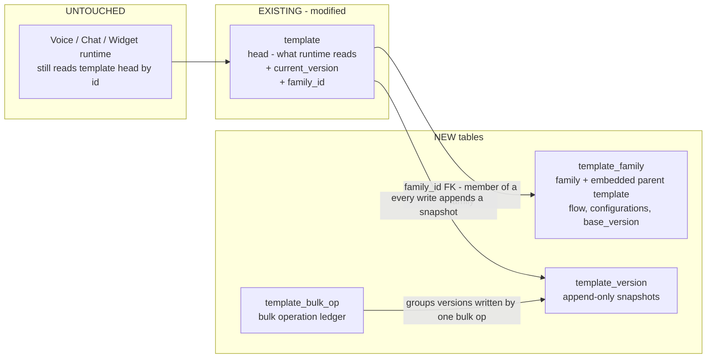
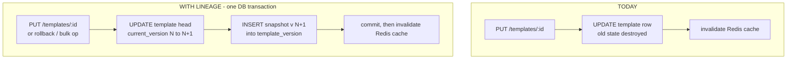
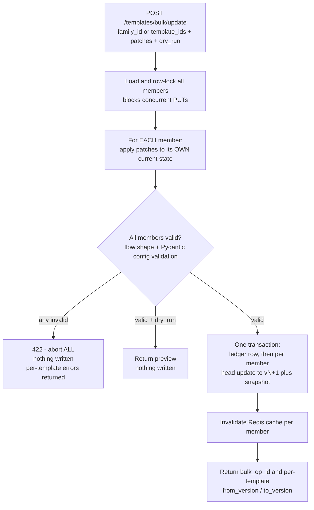
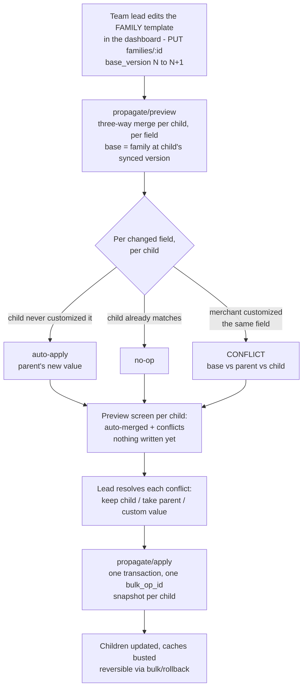
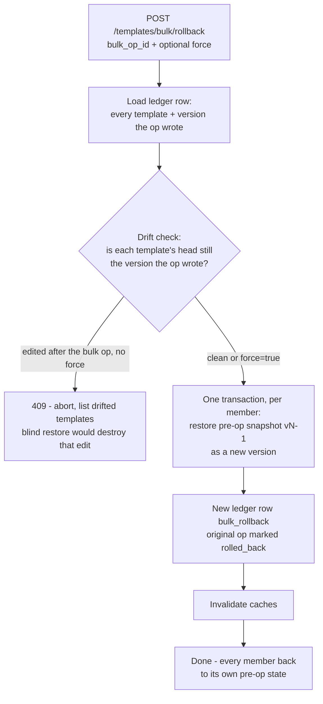
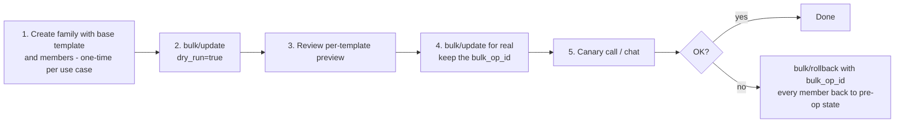

# Template Lineage & Family — Architecture

**Status:** Phase 1 + Phase 2 implemented · **Owner:** Voice Platform · **Last updated:** 2026-08-13

Safe **bulk update** and **bulk rollback** of Breeze Buddy templates on PROD, without losing any template's individual system prompts or configuration.

---

## 1. Problem

Every voice/chat agent is a template (`template` table, one row each). Today:

- `PUT /templates/{id}` **overwrites the row in place** — there is no history. Once an edit lands, the previous state is gone forever.
- Templates that serve the same use case for different merchants have **different system prompts and configs**, so there is no safe way to change one shared setting (e.g. a TTS provider, a compliance line in a prompt) across 200 templates at once.
- If a change misbehaves on PROD, there is **nothing to roll back to**.

What we verified about today's system (important for the design):

- The `template` row is the single source of truth at runtime. **Nothing snapshots it**: voice reads it from Postgres at call connect, chat/widget read it via a 60-second Redis cache on every turn.
- The **only writers** of the table are the templates REST endpoints. There is exactly one write path to intercept.

## 2. Concepts

| Concept | What it is | What it answers |
|---|---|---|
| **Lineage** (vertical) | Append-only version history of one template. Every write becomes version N+1; old versions are never modified. | *"What did this template look like before? What can I roll back to?"* |
| **Family** (horizontal) | A first-class entity (`template_family` row): a named group of templates for the same use case across merchants. The family row **contains the base (parent) template itself** — same content columns as `template` — as the canonical reference the children derive from. | *"Which templates should this bulk operation touch, and what is the canonical template they derive from?"* |

Analogy: a family is a repo, the base template is `main`, each member template is a merchant's branch, lineage is the commit log. Rollback is a `revert` (a new commit that restores old content) — never history rewriting.

## 3. What we add (and what we don't touch)



**Runtime is untouched.** Calls, chat turns, and widget sessions keep reading the head row exactly as today. Versioning happens entirely on the write path.

### 3.1 Columns added to existing `template` table

| Column | Type | Purpose |
|---|---|---|
| `current_version` | `INTEGER NOT NULL DEFAULT 1` | Head pointer; bumped atomically on every write |
| `family_id` | `UUID NULL`, FK → `template_family(id)` | Membership in a family. `NULL` = not in any family (nothing changes for that template) |

### 3.2 New table: `template_version` (the lineage)

One row per template state, ever. Written in the **same transaction** as the head update — the two can never diverge.

| Column | Purpose |
|---|---|
| `template_id`, `version` | Which template, which version (unique together) |
| `reseller_id`, `merchant_id`, `name`, `flow`, `expected_payload_schema`, `expected_callback_response_schema`, `configurations`, `secrets`, `telephony_number_id`, `is_active`, `supported_channels` | **Full snapshot** of every editable column at that version (full copy, not a diff → rollback is a single-row read, no chain replay) |
| `change_source` | `backfill` \| `create` \| `manual_edit` \| `bulk_update` \| `rollback` \| `bulk_rollback` |
| `bulk_op_id` | Set when a bulk operation wrote this version |
| `changed_by`, `created_at` | Audit trail |

Storage is a non-issue: templates are KB-sized JSONB (TOAST-compressed). Migration backfills **version 1 = current state** for every existing template.

**Retention — only the last 10 versions per template are kept.** The snapshot insert and the prune run in the same transaction, so the table self-maintains (no cron, no trigger):

```sql
DELETE FROM template_version tv
WHERE tv.template_id = $1
  AND tv.version <= $2 - 10          -- $2 = the current_version just written
  AND NOT EXISTS (                   -- rollback-safety guard, see below
        SELECT 1
        FROM template_version bv
        JOIN template_bulk_op op ON op.id = bv.bulk_op_id
        WHERE bv.template_id = tv.template_id
          AND op.status = 'completed'
          AND tv.version >= bv.version - 1
          AND tv.version <= bv.version
  );
```

- The limit is config-driven, not hardcoded: the `10` is a bind parameter fed into the DELETE from the `TEMPLATE_VERSION_RETENTION` env var (read once at startup in `app/core/config/static.py`, default 10). The pruning itself happens entirely in Postgres; the env var only supplies the number, so retention can be changed without a code deploy.
- **Rollback-safety guard:** bulk rollback restores each member's *pre-op* snapshot (`bulk-written version − 1`). Without a guard, 10+ edits to a child *after* a propagation would prune that snapshot and silently destroy the ability to bulk-revert. The `NOT EXISTS` clause therefore never deletes versions still needed by an active (`completed`, not-yet-rolled-back) bulk op — the bulk-written version and the one immediately before it.
- **UI warning (frontend requirement):** the version dropdown holds at most 10 entries. On the bulk-ops screen, any op whose pre-op snapshots are no longer fully present (possible for *older* ops once a newer bulk op takes over the protection) must show a warning badge: *"rollback no longer available for N of M templates — history pruned."* Attempting such a rollback also fails loudly server-side (the missing snapshot is reported per template), so the badge is a courtesy, not the only line of defense.

The same retention limit applies to `template_family_version` (`TEMPLATE_VERSION_RETENTION` family revisions per family), with the analogous guard: a revision referenced by a completed propagation op's `from_base_version` or `to_base_version` is never pruned, because that is exactly what a bulk rollback with `also_revert_family` restores.

**Deletion:** `template_version.template_id` references `template(id)` with `ON DELETE CASCADE` — deleting a template deletes its history with it. This keeps today's delete semantics unchanged (delete is already admin-only and blocked while any `call_execution_config` or active lead references the template). If we ever need audit history to outlive deletion, the follow-up is soft-delete on `template` (an `is_deleted` flag), not orphaned version rows.

**Concurrency:** version numbers can never collide. Every write uses a single atomic `UPDATE template SET ... , current_version = current_version + 1 ... RETURNING current_version` — Postgres serializes concurrent updates on the same row, so two simultaneous PUTs get N+1 and N+2, never the same number. The snapshot insert uses the RETURNING value inside the same transaction, and `UNIQUE (template_id, version)` is the hard backstop. Bulk operations additionally take `FOR UPDATE` row locks on all members, because they read-patch-validate-write across multiple statements.

### 3.3 New table: `template_family` (the family, containing its parent template)

The family is a first-class row that **contains the base (parent) template inline** — the same content columns as the `template` table. Opening a family shows the canonical template directly: no join, no separate template row that could be dialed or deleted independently. `family_id` on member templates is a foreign key to this table's `id` (created by `POST /templates/families`, never a free-floating UUID).

Families are **global admin-managed groups**: they have no `reseller_id`. Members can come from any reseller or merchant — the individual `template` rows each retain their own `reseller_id` / `merchant_id` for tenancy purposes at runtime.

| Column | Purpose |
|---|---|
| `id` | The `family_id` members point at |
| `name`, `description` | Human-readable identity (e.g. "order-confirmation") — what shows up in listings |
| `flow`, `expected_payload_schema`, `expected_callback_response_schema`, `configurations`, `supported_channels` | **The parent template's content** — mirrors the `template` table's content columns |
| `base_version` | Bumped on every edit of the parent content — children record which revision they derived from |
| `created_by`, `created_at`, `updated_by`, `updated_at` | Audit trail — `updated_at`/`updated_by` answer *"when did we last update the family template, and who"* |

**Deliberately NOT copied from `template`:** `reseller_id`, `merchant_id` (a family is global — members bring their own tenancy), `telephony_number_id` + `is_active` (the parent is not in the `template` table at all, so it structurally *cannot* receive calls or leads — stronger than any flag), and `secrets` (children hold their own real secrets; duplicating them at family level is risk with no benefit).

**How children relate to it:** a child is created by copying the family's content into a new `template` row (scoped to any merchant) and then customizing — different prompt wording, language, voice. The parent stays the readable reference of what the family *should* look like; children are its merchant-specific variations.

**Where you view it:** `GET /templates/families` lists every family with name, `base_version`, and `updated_at`. `GET /templates/families/{id}` returns the parent template content inline plus all members with their `current_version` — so at a glance: *this is the family, this is the parent template, this is when it last changed, these are the children derived from it.* Editing the parent goes through `PUT /templates/families/{id}` (bumps `base_version`). The bulk-op ledger joins here too via `template_bulk_op.family_id`.

### 3.4 New table: `template_bulk_op` (the ledger)

One row per bulk operation — this is what makes bulk rollback possible: it remembers exactly which templates were touched and with what patch.

| Column | Purpose |
|---|---|
| `op_type` | `bulk_update` \| `bulk_rollback` \| `propagation` |
| `family_id`, `template_ids` | Scope of the operation |
| `patch` | The JSON patch that was applied (audit / reproducibility) |
| `status` | `completed` \| `rolled_back` |
| `reverted_bulk_op_id` | On a rollback op: which update op it reverted |
| `from_base_version`, `to_base_version` | Propagation ops only: which family revision the children moved from / to. `from_base_version` is what `also_revert_family` restores the family to, and what the reverted children's `derived_from_base_version` is reset to |
| `initiated_by`, `created_at` | Audit trail |

**Why no per-template from/to versions here:** they are not duplicated into the ledger — every `template_version` row written by a bulk op carries that op's `bulk_op_id`. So the exact per-template versions come from `template_version` directly (`WHERE bulk_op_id = ...` gives each `(template_id, to_version)` pair, and the pre-op state is simply `to_version - 1`). That query is exactly how bulk rollback resolves what to restore; one source of truth, indexed.

## 4. Write path — before vs after



Applies uniformly to all writes — manual PUT, single rollback, bulk update, bulk rollback. Each just uses a different `change_source`. The API contract of the existing endpoints does not change (new fields on responses are read-only and ignored on PUT round-trips).

## 5. How bulk update keeps per-template customizations

The core trick: we do **not** copy one template onto the others. Each template's **own current state** is patched with a **JSON merge patch** — only the keys named in the patch change; everything else (each merchant's unique prompt, language, voice) is untouched.

- `configurations_patch` — merge-patch the `configurations` JSONB (e.g. switch TTS provider everywhere).
- `flow_patch` — merge-patch top-level flow keys (e.g. direct-mode `system_prompt`).
- `node_patches` — because `flow.nodes` is an array (merge patch would replace it wholesale), nodes are addressed **by `node_name`**: patch node `greeting` in every member, whatever else its flow contains.

**Guardrail:** a `flow_patch` containing the `nodes` key is **rejected with 422**. A merge patch would silently replace every member's entire node list — the exact thing this design exists to prevent. Node edits go through `node_patches` only; `flow_patch` is for top-level flow keys (e.g. direct-mode `system_prompt`).



**All-or-nothing:** if the patch breaks even one template's validation, the entire operation aborts and PROD is untouched. `dry_run=true` previews the result without writing.

## 6. Editing the family from the dashboard — propagation & merge conflicts — **built (Phase 2)**

Section 5's explicit patches are the low-level mechanism. The **dashboard workflow** builds on top of it: the team lead opens the family, edits the **parent template** directly, and the system carries that edit into every child — surfacing merge conflicts for manual resolution where a merchant customized the same spot.



### 6.1 The merge is three-way, per field (like git, but on JSON fields, not text lines)

For every field the lead changed on the parent, compared per child:

| Child's current value | Outcome |
|---|---|
| Still equals the **old** family value (merchant never touched it) | **Auto-apply** the parent's new value |
| Already equals the **new** value | No-op |
| Something else (merchant customized this exact field) | **CONFLICT** — needs a human decision |

The conflict unit is a JSON field (e.g. the `greeting` node's prompt string), not a text line. For long prompts the UI can render an intra-string text diff for readability, but resolution replaces the whole field: **keep child's value**, **take parent's value**, or **enter a custom value**.

### 6.2 What this needs in the schema (Phase 2 additions)

| Addition | Why |
|---|---|
| `template_family_version` table — **shipped in migration `046`** | Full snapshot of the parent content per `base_version` — the merge needs the **old** parent value as its base, and this also gives the parent a viewable history (same shape as `template_version`) |
| `template.derived_from_base_version` — **shipped in migration `046`** | Which family revision each child was last synced to — the merge base is the family snapshot at *this* version, so children that skipped an earlier propagation still merge correctly (the skipped changes simply show up in this round). This is **head-only metadata** — it is **not** part of the `template_version` snapshot (content is versioned; the sync pointer is bookkeeping, restored explicitly on rollback via `also_revert_family`) |

### 6.3 The flow, end to end

1. Lead edits the parent → `PUT /templates/families/{id}` (bumps `base_version`, snapshots the old content into `template_family_version`).
2. `POST /templates/families/{id}/propagate/preview` — computes the three-way merge for every child; **writes nothing**. Returns per child: auto-applied fields, no-ops, and conflicts (each with base/parent/child values).
3. UI shows the preview; lead resolves each conflict.
4. `POST /templates/families/{id}/propagate/apply` with the resolutions — the per-child results become per-child patches fed into the **same bulk machinery as section 5**: one all-or-nothing transaction, one `bulk_op_id`, a version snapshot per child, `derived_from_base_version` updated, caches invalidated.
5. Regret it? `POST /templates/bulk/rollback {bulk_op_id}` — same drift-guarded rollback as any bulk op.

Propagation is implemented — see §8.2 for the endpoints and §6.4 for the merge specifics as built.

### 6.4 Merge specifics (as built)

**The conflict unit is a field path.** Four shapes: `flow.<key>` (top-level flow key), `flow.nodes.<node_name>` (a whole node — used when the node was added or removed on one side, or is absent from the child), `flow.nodes.<node_name>.<key>` (one key of a node all three sides have), `configurations.<key>`.

**Add / remove.** A key or node the family edit added auto-applies when the child does not have it, no-ops when the child already has the same value, conflicts otherwise. A key or node the family edit removed auto-removes when the child's copy is untouched, no-ops when the child already dropped it, conflicts when the merchant customized it. Anything only the child has is never touched.

**Merge base, including never-synced children.** The base is the family snapshot at the child's `derived_from_base_version`. If that is `NULL` (the child predates propagation or joined the family without one) or the snapshot was pruned, the base is the family revision immediately before the one being propagated. A never-synced child can only honestly be treated as in sync with everything except the edit happening right now: basing on v1 would replay every historical family change as a conflict against a merchant who never opted into them, and basing on the child's own content would classify every field as a no-op and propagate nothing. If no base is available at all, the parent content itself is used, which makes the merge a no-op — a child is never silently overwritten.

**Preview is stateless.** No preview token, nothing cached server-side. The preview echoes the family's `base_version` (wire field `to_base_version`) and every child's `current_version`; apply re-runs the identical merge under `FOR UPDATE` locks and treats those echoes as optimistic-concurrency assertions — 409 if the family or any child moved, 409 if a template joined the family in between, 422 if any conflict is unresolved or if a resolution matches no conflict (a stale preview). The preview response also flags each change with `auto_applied` so the UI can distinguish an auto-merge from a conflict that still needs a decision.

**Secrets.** Family versions store the family row verbatim, and that row is mask-level by construction: the family has no `secrets` column, and every family write runs `mask_mcp_auth_secrets` over `configurations` first, so `template_family` / `template_family_version` can never hold a real MCP auth token even if an admin pastes one into the create/update body. Children do hold real secrets, so the preview masks the child-side value of every `configurations.*` conflict — and the base/parent sides too. The merge itself compares raw values, so classification stays correct. Neither a `parent` nor a `custom` resolution can write a masked placeholder into a child: for a `configurations.*` field whose resolved value contains one, apply keeps the child's existing raw value (422 if the child has none, so the real value must be resubmitted).

## 7. Rollback

### 7.1 Single template

`POST /templates/{id}/rollback {version: N}` → snapshot N is written back as a **new** version (history stays append-only, so a rollback can itself be rolled back).

### 7.2 Bulk rollback



The **drift guard** is the PROD-safety centerpiece: rollback refuses to clobber a manual edit that landed after the bulk update, unless explicitly forced.

## 8. API surface — mapped to the dashboard flows

Existing five template endpoints (`POST/GET/PUT/DELETE /templates…`) are unchanged. Every new endpoint below exists for a specific moment in a dashboard flow — nothing is speculative.

### 8.1 Template screen (any template — family member or not)

The per-template version UI. Ships with Phase 1, needs zero family features.

| Method & Path | Who | When the dashboard calls it |
|---|---|---|
| `GET /templates/{id}/versions` | template access | Opening a template: populates the **version dropdown** (up to 10 entries — version, who changed it, when, why: `manual_edit`/`rollback`/`bulk_update`) |
| `GET /templates/{id}/versions/{n}` | template access | User picks an old version in the dropdown: shows/diffs that version's full content (secrets masked) |
| `POST /templates/{id}/rollback` | admin / reseller owner | The **"Restore this version"** button next to the dropdown — restores version n as a NEW head version |

(A normal save on this screen is the existing `PUT /templates/{id}` — it now auto-appends a version, no frontend change needed.)

### 8.2 Family screen

Create/manage families; the lead's edit-and-propagate flow (§6). All family endpoints are **admin-only** — families are global admin-managed groups with no reseller scoping.

| Method & Path | Who | When the dashboard calls it |
|---|---|---|
| `POST /templates/families` | **admin** | **"Create family"** dialog — name + parent content (or `copy_base_from_template_id` to seed from an existing template) + initial member selection. Validates the flow shape same as a template create |
| `GET /templates/families` | **admin** | The **family list page** — name, `base_version`, last updated, member count |
| `GET /templates/families/{id}` | **admin** | Opening a family: parent template rendered inline + member list with each child's `current_version` |
| `PUT /templates/families/{id}` | **admin** | Lead hits **"Save"** after editing the parent — bumps `base_version`, snapshots the old parent content, re-validates flow shape. Step 1 of §6 |
| `PATCH /templates/families/{id}/members` | **admin** | **"Add / remove members"** on the family detail page |
| `GET /templates/families/{id}/versions` | **admin** | Family screen version dropdown — history of the parent template |
| `GET /templates/families/{id}/versions/{n}` | **admin** | Viewing/diffing one historical parent revision |
| `POST /templates/families/{id}/rollback` | **admin** | **"Restore this revision"** on the family screen — restores parent content as a NEW `base_version`. Children are untouched; run propagate/preview afterwards to carry it into them |
| `POST /templates/families/{id}/propagate/preview` | **admin** | Fires automatically after the save (or on **"Apply to children"**): three-way merge of the edit into all children — returns auto-merges + **conflicts**, writes nothing. Powers the preview/conflict screen |
| `POST /templates/families/{id}/propagate/apply` | **admin** | Lead finished resolving conflicts, hits **"Apply"**: writes all children in one transaction as `op_type='propagation'`, returns the `bulk_op_id` the UI must keep/show for revert |

### 8.3 Rollout history & revert screen

| Method & Path | Who | When the dashboard calls it |
|---|---|---|
| `GET /templates/bulk/ops` | **admin** | The **rollout history page**: every bulk apply/revert with scope, patch, who, when. Ops whose pre-op snapshots were pruned (retention, §3.2) get the **"rollback no longer available for N of M templates"** warning badge, via `rollback_unavailable_count` on the op row |
| `POST /templates/bulk/rollback` | **admin** | The **"Revert this rollout"** button on a history row — drift-guarded (409 lists children edited after the rollout → the UI's force-confirm dialog sends `force: true`). Also reverts `propagation` ops (the family's own bulk mechanism). The **"also revert the family template"** checkbox sends `also_revert_family: true` — propagation-ops only (422 otherwise); 422 if that propagation has no `from_base_version` at all (it created `base_version` 1, so there is nothing to restore to); 409 if a `from_base_version` exists but that family revision was pruned by retention |

### 8.4 Not in the dashboard: the ops escape hatch

| Method & Path | Who | What it's for |
|---|---|---|
| `POST /templates/bulk/update` | **admin only, API-only** | Hand-written merge patch applied to a family / explicit template list (`dry_run` supported). **The dashboard never calls this.** It exists for ops emergencies — e.g. a dead webhook URL failing calls across 200 templates *right now*: one API call fixes them without the family-edit → preview → resolve ceremony. Everything it writes still goes through the same ledger + snapshots, so it stays revertible like any rollout |

## 9. PROD operating playbook



**Rollout order:** run migration first (purely additive — old code ignores the new columns), then deploy the code. In-flight calls behave exactly as with today's PUT: they keep the config they loaded at connect.

## 10. Phasing & explicitly out of scope

**Phase 1 (implemented):** lineage, families with embedded parent, explicit bulk patch + bulk rollback. **Phase 2 (implemented):** dashboard propagation with three-way merge + conflict-resolution API (§6), `template_family_version`, `derived_from_base_version`, family version history + rollback, bulk rollback of propagation ops including `also_revert_family`.

Remaining follow-ups (not built):

- **Version pinning on calls** — stamping the template version onto `lead_call_tracker` so every historical call is traceable to the exact content that ran it. Small follow-up.
- UI for version diffing.

---

*Implementation-level companion (schemas, SQL, task breakdown, tests): `docs/superpowers/plans/2026-08-03-template-lineage-versioning.md`.*
