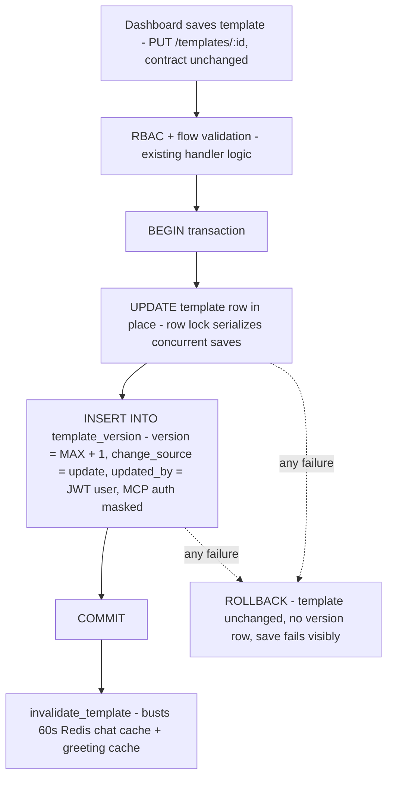
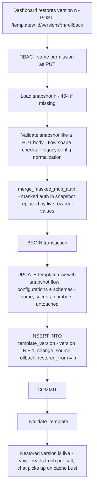
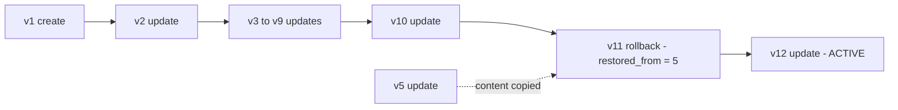

# Template Versioning & Rollback

> Status: **Implemented** — migration 036 (table + last-10 retention trigger);
> endpoints under `/templates/{id}/versions`. Verified end-to-end against a local
> DB: create → edits → history → diff → rollback, with the append-only invariants
> confirmed in SQL (see §11).
> Owner: Breeze Buddy platform
> Date: 2026-07-18

## 1. Problem

Breeze Buddy templates live in a single Postgres row (`template` table) with two JSONB
blobs: `flow` (the conversation node graph) and `configurations` (STT/TTS/VAD/LLM/
telephony config). Every dashboard save calls `PUT /templates/{id}` →
`replace_template()`, which is a **destructive in-place UPDATE**. The previous
contents are gone the moment someone saves. There is no history, no diff, and no way
to recover from a bad edit. (`docs/CHAT_MODE.md` already flags template versioning as
known future work.)

## 2. Decisions (approved)

| Decision | Choice | Rationale |
|---|---|---|
| Version store | **New Postgres `template_version` table** (not S3/GCS) | Snapshot is written in the *same transaction* as the save — a save can never exist without its rollback point. A bucket write is a separate network call that can fail silently. Diff/rollback become single queries. Blobs are KBs; storage cost is cents either way, and a metadata table in Postgres would be needed even with a bucket. |
| Editing semantics | **Unchanged** — dashboard saves still update the live template directly | No draft/publish flow in v1. |
| Rollback | Restore any prior version; the restored content **becomes live immediately** as a *new* version | Append-only history stays a straight line; nothing is ever lost. |
| Active version | **Always the row with the highest `version_number`** | No flags or pointers that can drift. Live `template` row content == latest version row content, guaranteed by the transaction. |
| Per-call version stamping | **Not in v1** | Explicitly skipped. |
| Secrets | **Excluded from snapshots** | `secrets` column is never snapshotted. MCP auth values inside `configurations` are stored **masked** (`****`); on rollback the live row's real values are carried forward via the existing `merge_masked_mcp_auth` semantics. This guarantee covers only the `secrets` column and MCP auth inside `configurations` — auth literals hand-pasted into `flow` (instead of `{credential_name}` placeholders) are snapshotted verbatim like the rest of the flow, so use credential placeholders in flow text, never raw tokens. |

### 2.1 Why Postgres and not GCS/S3 for the snapshots

The blobs *could* live in a bucket; they deliberately don't. The full reasoning:

1. **Atomicity is the whole feature.** The snapshot must exist for exactly the
   saves that happened. In Postgres, the live-row `UPDATE` and the snapshot
   `INSERT` commit in **one transaction** — either both happen or neither. A
   bucket upload is a separate network call that can fail independently, which
   creates the worst failure mode possible for this feature: a save that
   succeeded but has no rollback point, discovered only when someone needs it.
2. **A bucket doesn't remove the Postgres table — it adds to it.** The dashboard
   needs a version list (who, when, which number, restored-from) and pagination.
   That metadata index has to be a Postgres table regardless; GCS would only
   hold the blob bytes. So the real comparison is "one table" vs "one table +
   one bucket + dual-write failure handling."
3. **Diff and rollback are single queries.** Fetching two versions to diff or
   restoring one is one indexed read. With GCS it's object downloads on every
   diff view — slower dashboard, more failure modes, and rollback would depend
   on bucket availability.
4. **RBAC and backups come free.** Version rows inherit the same
   reseller/merchant scoping enforcement as every other template query, and live
   inside the existing DB backup/restore story.
5. **Cost is a non-factor at this data size.** Snapshots are kilobytes. Even an
   extreme 1,000 templates x 100 versions x 50 KB is ~5 GB: ~$0.85/month on
   Cloud SQL storage vs ~$0.10/month on GCS. Realistic near-term volume
   (~100 templates x 20 versions x 30 KB = ~60 MB) costs under a cent on either.
   GCS is the cheaper storage *medium*; Postgres is the cheaper *system*.
6. **Escape hatch preserved.** If the table ever grows into real money, versions
   older than N months can be archived to GCS via the existing `GCSStorage`
   helper with zero API changes — the metadata rows stay, only cold blobs move.

## 3. The one invariant

> **`template_version` is append-only. Nothing is ever deleted or modified. The
> active version is always `MAX(version_number)`. Every action — create, edit,
> rollback — only appends a new row, inside the same transaction that writes the
> live `template` row.**

Everything the dashboard needs falls out of this rule.

## 4. Schema

New sequential migration `036_create_template_version_table.sql`:

```sql
CREATE TABLE template_version (
    id                                UUID PRIMARY KEY DEFAULT gen_random_uuid(),
    template_id                       UUID NOT NULL REFERENCES template(id) ON DELETE CASCADE,
    version_number                    INT NOT NULL,
    name                              VARCHAR NOT NULL,        -- display only
    flow                              JSONB NOT NULL,
    configurations                    JSONB,                   -- MCP auth masked
    expected_payload_schema           JSONB,
    expected_callback_response_schema JSONB,
    updated_by                        VARCHAR,                 -- dashboard user (JWT)
    change_source                     VARCHAR NOT NULL,        -- 'create' | 'update' | 'rollback'
    restored_from                     INT,                     -- only for 'rollback'
    created_at                        TIMESTAMPTZ NOT NULL DEFAULT NOW(),
    UNIQUE (template_id, version_number)
);

CREATE INDEX idx_template_version_template_id
    ON template_version (template_id, version_number DESC);
```

The migration also **backfills version 1** (`change_source = 'create'`) for every
existing template from its current live row, so every template has a baseline the
moment the feature ships.

### What is versioned vs. what stays live-only

| Versioned (snapshotted every save) | Live row only (never versioned, never touched by rollback) |
|---|---|
| `flow` | `secrets` |
| `configurations` (MCP auth masked) | `outbound_number_id` |
| `expected_payload_schema` | `is_active` |
| `expected_callback_response_schema` | `supported_channels`, inbound-policy flags |
| `name` (display only — rollback does **not** rename) | `reseller_id` / `merchant_id` scoping |
| | Related tables: `call_execution_config`, `credentials`, `outbound_number` |

Rollback restores only `flow`, `configurations`, and the two schemas. Name,
numbers, secrets, and channel flags always stay as they currently are — this avoids
uniqueness-constraint collisions on rename and surprise phone-number/credential
changes.

## 5. Write path

Both mutations happen inside **one asyncpg transaction**. The in-place `UPDATE` on
`template` row-locks it, serializing concurrent saves; the
`UNIQUE (template_id, version_number)` constraint is the backstop.



`POST /templates` is identical except the version row is v1 with
`change_source = 'create'`.

## 6. Rollback path



## 7. Lifecycle example

Template created, edited nine times (→ v10), rolled back to v5, then edited again:



How the table reads for this template (dashboard sorts descending, labels the top
row **Active**):

| version_number | change_source | restored_from | dashboard shows |
|---:|---|---:|---|
| 12 | update | — | **Active** — edit made after the rollback |
| 11 | rollback | 5 | restored from v5 |
| 6 – 10 | update | — | still here, all restorable |
| 5 | update | — | its content lived again as v11 |
| 1 – 4 | create / update | — | first versions |

Key answers this encodes:

- **Create** → v1 (`create`). **Edit** → v2 (`update`).
- **Rollback to v5 from v10** → v11 (`rollback`, `restored_from = 5`); **v6–v10 are
  untouched** and remain restorable.
- **Which version is active?** Always the highest number. No flag to query or keep
  in sync.
- **Edit after rollback** → v12 (`update`), building on v5's content. History never
  forks — no branches, no "v5.1".

## 8. API

Three new endpoints on the existing templates router
(`app/api/routers/breeze_buddy/templates/`):

| Endpoint | Purpose | RBAC |
|---|---|---|
| `GET /templates/{id}/versions` | Paginated history: `version_number, name, updated_by, change_source, restored_from, created_at`. **No blobs** — fast list panel. | `validate_template_access` (same as GET) |
| `GET /templates/{id}/versions/{n}` | Full snapshot of one version. Dashboard fetches two and renders the diff client-side. | same as GET |
| `POST /templates/{id}/versions/{n}/rollback` | Restore version *n* (see §6) | same as PUT |

Error shapes match the existing template endpoints: 404 unknown template/version,
400 validation failure, 403 RBAC.

## 9. What does NOT change

- **Runtime**: zero changes. Voice (`FlowConfigLoader`), chat/widget (Redis-cached
  reads), playground overrides, leads flow, campaigns, `call_execution_config` —
  none of them read `template_version`.
- **Dashboard save flow**: `PUT` request/response contracts are unchanged.
- **Delete**: stays admin-only; `ON DELETE CASCADE` removes history with the
  template.
- **Retention**: the **10 most recent versions per template** are kept. An
  `AFTER INSERT` trigger (`trg_prune_template_versions`, migration 036) deletes
  anything older on every insert, so pruning is atomic with the save and covers
  every write path — API save, rollback, backfill, or manual SQL. Ordinals are
  never reused: a template reaching v11 keeps v2..v11 and simply develops a gap
  at the bottom. To change the limit, ship a migration that
  `CREATE OR REPLACE`s the function with a different `OFFSET`.

  Two consequences worth knowing: **rollback consumes a slot** (restoring v11
  while holding v11..v20 creates v21, pushing v11 itself off the end — its
  content survives as v21), and a `restored_from` label can reference a version
  that has since been pruned (display text only, nothing breaks). Storage is not
  the constraint here — measured at ~12 KB per snapshot, even 50k templates x 10
  versions is ~4 GB, well under $1/month — so the cap is a tidiness choice, and a
  larger limit costs effectively nothing if 10 proves too tight in practice.

## 10. Layering (follows repo conventions)

| Layer | New/changed files |
|---|---|
| Migration | `app/database/migrations/036_create_template_version_table.sql` (table + backfill) |
| Queries | `app/database/queries/breeze_buddy/template_version.py` (insert, list, get-by-number, max-version) |
| Accessor | `app/database/accessor/breeze_buddy/template_version.py`; `template.py` `create_template` / `replace_template` gain transactional snapshot writes |
| Decoder | `app/database/decoder/breeze_buddy/template_version.py` |
| Schemas | `TemplateVersionModel` / list + response models in `template/types.py` (or `schemas/breeze_buddy/`) |
| Router | version-list, version-get, rollback endpoints in `app/api/routers/breeze_buddy/templates/` |

## 11. Verification checklist

1. Create template → history shows v1 (`create`).
2. Save 3 edits → v2–v4 (`update`), live row == v4 content.
3. Fetch v2 and v4 → diff renders.
4. Rollback to v2 → live row == v2 content; history shows v5 (`rollback`,
   `restored_from = 2`); chat Redis cache busted; next voice call uses restored flow.
5. Edit again → v6 (`update`).
6. Concurrent PUT race → both saves succeed serially with distinct version numbers
   (or one fails cleanly on the unique constraint; never a duplicate/skipped number).
7. Snapshot with masked MCP auth rolled back → live row keeps real auth values.
8. Save failure mid-transaction → no template change AND no version row.
