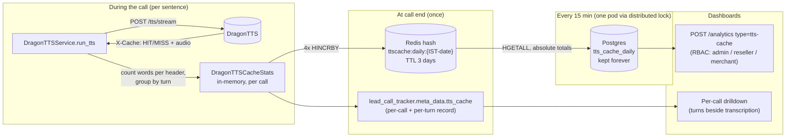
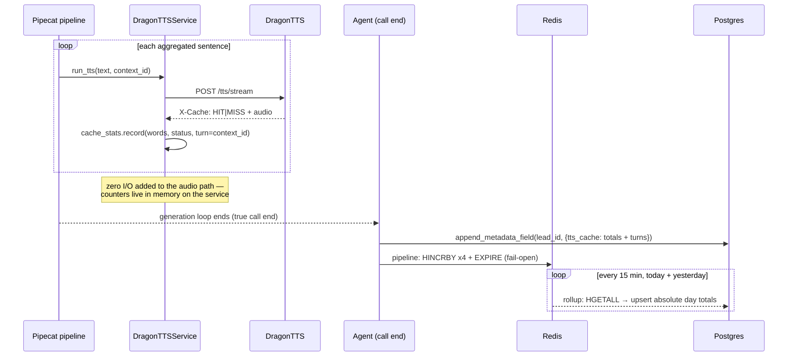

# TTS Cache Metrics (DragonTTS Attribution)

**What this answers:** for every call, every day, every template — how many of the
words the agent spoke were served from the DragonTTS cache (**HIT**) versus
actually synthesized by the real TTS provider behind it (**MISS**)?

Before this feature, DragonTTS knew its own global hit rate but nothing about
*whose* traffic it was (no tenant identity reaches DragonTTS), and clairvoyance
threw the per-sentence `X-Cache` response header away. Now the header is
captured on the clairvoyance side, where `reseller_id` / `merchant_id` /
`template_id` / `lead_id` are all known — giving per-call, per-turn, and
per-day attribution **without any change to the DragonTTS repo**.

---

## 1. The signal: DragonTTS already tells us HIT or MISS

The live pipeline sends TTS one **aggregated sentence at a time** to
`POST /tts/stream`. Every response comes back stamped by DragonTTS:

```text
POST /tts/stream   {"transcript": "Your order will arrive tomorrow.", ...}
← 200 OK
  X-Cache: HIT            ← served from cache; the real provider did nothing
  <audio chunks>

POST /tts/stream   {"transcript": "Hi Ramesh, calling about order 4821.", ...}
← 200 OK
  X-Cache: MISS           ← Cartesia/ElevenLabs/... actually synthesized this
  <audio chunks>
```

Notes on semantics:

- **All-or-nothing per sentence.** DragonTTS's partial "stitch" paths
  (`MISS-STITCH`) are disabled/retired in config — a sentence is either fully
  cached or fully synthesized. A *turn* can still mix, because one turn is
  several sentences.
- **Single-flight coalescing:** if two calls request the same uncached
  sentence simultaneously, DragonTTS synthesizes once; the trigger gets
  `MISS`, the waiter gets `HIT`. So our MISS counts measure *real provider
  work* (and reconcile with DragonTTS's own `/stats/daily`).
- Any non-HIT status is counted as a miss.

## 2. End-to-end architecture



Division of labor: **Redis is the counter, Postgres is the record.** Postgres
is bad at hot counters (row locks + MVCC dead tuples on every increment);
Redis `HINCRBY` is an atomic, lock-free, in-place increment. So ~200k tiny
per-call increments/day are absorbed by Redis, and Postgres receives ~96 clean
upserts per combo per day from a single writer (the rollup task).

## 3. Life of one call



## 4. What is stored where

### 4.1 Redis — one hash per IST day (TTL 3 days)

A Redis **hash** is a dictionary stored under one key. The **field name
encodes the dimensions** (pipe-delimited, `-` for unknown), the **value is the
running count**:

```text
KEY   ttscache:daily:2026-07-18
FIELD {provider}|{reseller_id}|{merchant_id}|{template_id}|{metric}

  cartesia|res_a|merchant_12|tmpl-9f3e|hit_req      9421   sentences from cache
  cartesia|res_a|merchant_12|tmpl-9f3e|miss_req     1310   sentences synthesized
  cartesia|res_a|merchant_12|tmpl-9f3e|hit_words   71204   words from cache
  cartesia|res_a|merchant_12|tmpl-9f3e|miss_words   9876   words the provider generated
```

- `provider` is the **nested** provider behind DragonTTS (`cartesia`,
  `elevenlabs`, `sarvam`, `gemini`) — the whole point is seeing through the
  proxy.
- Written once per call (4 `HINCRBY`s in one pipeline), not per sentence.
- Size does not grow with call volume — only with distinct
  provider × reseller × merchant × template combos (a few hundred fields).
- TTL 3 days = safety margin only; once the rollup has copied a day into
  Postgres, the Redis copy is scratch.

### 4.2 Postgres — per-call record (existing `meta_data` JSONB, no new table)

Merged into `lead_call_tracker.meta_data` under `tts_cache` at call end,
next to `transcription` — lay the two side by side for per-turn attribution:

```json
{
  "provider": "cartesia",
  "model": "sonic-3.5",
  "hit_requests": 9,  "miss_requests": 3,
  "hit_words": 74,    "miss_words": 21,
  "cache_word_ratio": 0.779,
  "turns": [
    {"turn": 1, "hits": 2, "misses": 0, "hit_words": 15, "miss_words": 0},
    {"turn": 2, "hits": 3, "misses": 1, "hit_words": 28, "miss_words": 7},
    {"turn": 3, "hits": 4, "misses": 2, "hit_words": 31, "miss_words": 14}
  ]
}
```

(Turn = the set of sentences sharing one pipecat `context_id`; capped at 200
turns per call. Rare agent-transfer calls with a rebuilt TTS store combined
totals plus a `generations` list.)

### 4.3 Postgres — `tts_cache_daily` (migration `036`, kept forever)

One row per `(date_ist, provider, reseller_id, merchant_id, template_id)`;
~one row per active template per day. Counters are **absolute day totals**
(overwritten, never incremented, so rollup re-runs are idempotent):

| date_ist | provider | reseller_id | merchant_id | template_id | hit_requests | miss_requests | hit_words | miss_words |
|---|---|---|---|---|---|---|---|---|
| 2026-07-17 | cartesia | res_a | merchant_12 | tmpl-9f3e | 9421 | 1310 | 71204 | 9876 |
| 2026-07-17 | elevenlabs | res_a | merchant_45 | tmpl-77aa | 2210 | 840 | 16780 | 6540 |

Hit rates are computed at read time: word cache ratio for row 1 =
71204 / (71204 + 9876) = **87.8%** — i.e. Cartesia only synthesized ~12% of
what that template spoke that day. Weekly = SUM over 7 days of rows. The
upsert's `ON CONFLICT` target matches the `COALESCE` expression unique index
so NULL merchant/template collapse into one bucket instead of duplicating.

## 5. API

`POST /analytics` with `{"type": "tts-cache", "filters": {...}, "options": {...}}`.

- Filters: `date_from` / `date_to` (IST dates), `reseller_id(s)`,
  `merchant_id(s)`, `template_id`, `provider`.
- `options.group_by`: `provider` | `merchant` | `template` | `date`.
  Grouping by **template** answers "how much is caching working per template"
  — it directly shows where `{variable}` personalization is defeating the
  cache.
- Response: `results` rows (each with derived `request_hit_rate` and
  `word_cache_ratio`) plus an overall `summary`.
- RBAC comes from the standard `apply_hierarchical_filters` flow: admin sees
  all, reseller sees their merchants, merchant sees themselves. The handler
  normalizes the singular `reseller_id`/`merchant_id` filter forms into the
  plural keys the query filters on (the singular form deliberately wins when
  both are sent, since RBAC validates only the singular in that case).

## 6. Failure behavior (deliberate trade-offs)

| Event | Effect |
|---|---|
| Redis hiccup during a call's flush | That one call's counters are dropped, logged, call unaffected (everything is fail-open; nothing in the audio/teardown path can raise) |
| Agent pod killed mid-call (deploy) | That call never reaches its end-of-call flush → its counts are missing. Stats-only trade-off; graceful SIGTERM drains flush normally |
| App deployment / pod rolling | No effect on counters — pods hold zero counter state; Redis and Postgres live outside the deployment |
| Rollup tick missed (pods cycling) | Nothing lost — counters keep accumulating; next tick upserts the same running totals (absolute + idempotent) |
| Redis down briefly | Lose the not-yet-rolled-up increments (≤15 min worth) plus the full stats of any call whose end-of-call flush happened during the outage (flushes are fail-open, not retried) |
| Redis fully wiped mid-day | Day restarts from 0; next rollup would overwrite the DB row downward (known edge; hardening option: `GREATEST(existing, EXCLUDED.x)` in the upsert, valid because within-day counters only grow) |

## 7. Code map

| Piece | Location |
|---|---|
| Header capture + per-call stats | `app/ai/voice/tts/dragontts.py` (`DragonTTSCacheStats`, `run_tts`) |
| Call-end flush (meta_data + Redis) | `app/ai/voice/agents/breeze_buddy/agent/__init__.py` (`_flush_tts_cache_stats`) |
| Redis day counters | `app/services/tts_cache_metrics/__init__.py` |
| Rollup task (`bb_ttscache_rollup`, 900s) | `app/services/tts_cache_metrics/rollup.py`, registered in `app/main.py` |
| Table + three-layer DB | `app/database/migrations/036_create_tts_cache_daily.sql`, `app/database/{queries,accessor,decoder}/breeze_buddy/tts_cache.py` |
| Analytics type `tts_cache` | `app/schemas/breeze_buddy/analytics.py`, `app/api/routers/breeze_buddy/analytics/{handlers.py,__init__.py}` |

## 8. Verifying on an environment

1. Apply migration 036; deploy.
2. Make a playground call on a DragonTTS template.
3. `lead_call_tracker.meta_data -> 'tts_cache'` shows totals + turns.
4. `redis-cli HGETALL ttscache:daily:$(TZ=Asia/Kolkata date +%F)` shows
   incremented fields (keys are IST-dated).
5. After a rollup tick (≤15 min): row appears in `tts_cache_daily`.
6. `POST /analytics {"type": "tts-cache"}` as admin and as a scoped reseller
   token — scoped results must differ.

## 9. Out of scope (deliberately)

- The one-shot `/tts/bytes` path (`_generate_dragontts_audio`, greetings) is
  not counted — only the live streaming conversation.
- Non-DragonTTS templates (direct ElevenLabs/Cartesia/...) have no cache and
  write nothing here.
- DragonTTS's own `/stats/daily` remains the admin-side global cross-check;
  our per-tenant numbers should reconcile with it.
