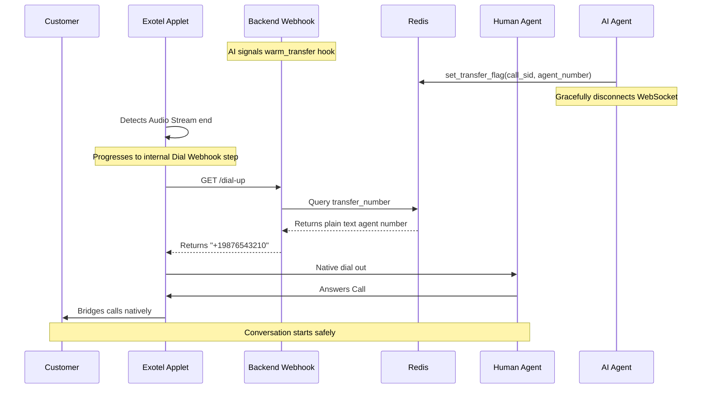

# Exotel Warm Transfer Flow

This document describes the Exotel-specific logic flow for implementing warm transfers in Breeze Buddy.

## Table of Contents

- [Core Mechanism](#core-mechanism)
- [Flow Steps](#flow-steps)

---

## Core Mechanism

Exotel transfers are handled by `ExotelConferenceService` (`app/ai/voice/agents/breeze_buddy/services/telephony/exotel/conference.py`).

Exotel operates via a UI-configured Applet flow. In Breeze Buddy, the AI sets the transfer context in Redis and then gracefully disconnects. The Exotel Applet detects the AI disconnection, proceeds to the next flowchart step in Exotel's system (a PASSTHRU/Dial webhook), and fetches the target agent number via API.

---

## Flow Steps

**Objective**: Transfer a live customer call from the AI bot to a human agent via Exotel.



```text
┌─────────────────────────────────────────────┐
│  FLOW: Exotel Warm Transfer                 │
└─────────────────────────────────────────────┘

TRIGGER: AI Function Call (`warm_transfer`) -> `set_transfer_flag` (Redis Cache Database)
INPUT:
  - customer_call_sid: "CA123..."
  - agent_phone_number (cached under the key `transfer:CA123...`)

STEPS:
  1. Internal Pre-transfer Sync (`ExotelConferenceService`)
     - The service returns a dummy "success" payload in Python. No outbound API call is made.
     - The AI bot signals a graceful hangup, terminating the active WebSocket audio stream.

  2. Exotel Applet Flow Resumes
     - Upon AI WebSocket disconnection, the Exotel Call framework progresses to the configured Applet widget.
     - The configured widget makes an HTTP GET to our `/dial-up` webhook.

  3. Backend Webhook Handles `/dial-up`
     - The webhook receives the GET request and queries Redis using the call SID as the key.
     - Redis returns the stored agent phone number, which the webhook returns as plain text to Exotel.

  4. Exotel Dials the Human Agent
     - Exotel dials the agent phone number returned by the webhook.
     - When the agent answers, Exotel bridges the agent's call leg to the waiting customer call.
     - The customer and human agent are now connected directly.
```
