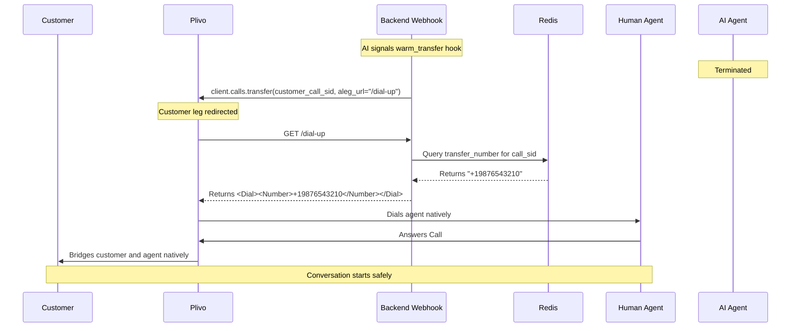

# Plivo Warm Transfer Flow

This document describes the Plivo-specific logic flow for implementing warm transfers in Breeze Buddy.

## 📋 Table of Contents

- [Core Mechanism](#core-mechanism)
- [Flow Steps](#flow-steps)

---

## 🔧 Core Mechanism

Plivo warm transfers are handled natively by `PlivoConferenceService` (`app/ai/voice/agents/breeze_buddy/services/telephony/plivo/conference.py`).

**Important Underlying Distinction**: Plivo does *not* utilize "Plivo Conferences" in this codebase. Instead, it relies on Plivo's native `calls.transfer()` API.

This API dynamically redirects the active customer call leg to a fresh secondary webhook URL, which then returns standard `<Dial><Number>` XML bridging them directly to the human agent.

---

## 🔄 Flow Steps

**Objective**: Effectively transfer a live customer call from the AI bot to a human agent exclusively via Plivo.



```text
┌─────────────────────────────────────────────┐
│  FLOW: Plivo Warm Transfer                  │
└─────────────────────────────────────────────┘

TRIGGER: AI Function Call (`warm_transfer`) -> `set_transfer_flag` (Redis Cache)
INPUT:
  - customer_call_sid: "CA123..."
  - agent_phone_number (Cached securely in Redis under `transfer:CA123...`)

STEPS:
  1. Trigger Native Sub-Transfer (`_transfer_call`)
     - The system invokes `client.calls.transfer()` securely on the active `customer_call_sid` parent leg directly.
     - The targeted payload points `aleg_url` explicitly to our secondary internal `/dial-up` webhook:
       `GET /agent/voice/breeze-buddy/plivo/callback/transfer/dial-up`

  2. Plivo Executes the Webhook Native Redirect Target
     - Plivo immediately executes a formal HTTP GET safely to the distinctly defined `/dial-up` endpoint provided.
  
  3. Internal Webhook Resolves Active Dynamic Target Agent Number (`handle_call_transfer` -> `_handle_transfer_dial_up`)
     - The internal secondary endpoint legitimately queries Redis sequentially for `transfer:CA123...`.
     - Systematically extracts the properly configured `transfer_number`.
  
  4. Webhook Comprehensively Responds with XML (`plivo_dial_xml`)
     - Backend crafts standard `<Dial><Number>+19876543210</Number></Dial>` XML natively.
     - Plivo elegantly receives the exact valid XML, specifically dials the required agent effortlessly, and implicitly securely bridges the customer uniquely on the exact same active leg.

OUTPUT:
  - success: True
  - agent_call_uuid: (Tracks the customer's UUID efficiently. Plivo securely manages the sub-leg natively).

CLEANUP:
  - The AI pod accurately terminates completely automatically securely following the successful native explicit execution seamlessly.
```
