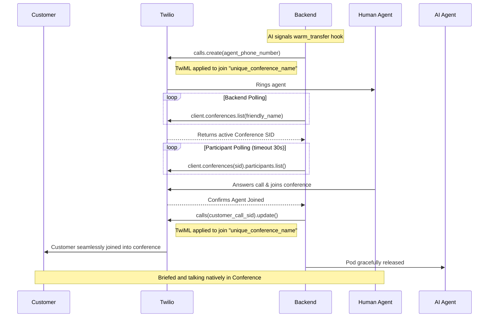

# Twilio Warm Transfer Flow

This document describes the Twilio-specific logic flow for implementing warm transfers in Breeze Buddy. Twilio uses its Conference API natively to seamlessly bridge the AI agent, customer, and human agent securely.

## 📋 Table of Contents

- [Core Mechanism](#core-mechanism)
- [Flow Steps](#flow-steps)
- [Integration Details](#integration-details)

---

## 🔧 Core Mechanism

Twilio warm transfers are natively orchestrated via the `TwilioConferenceService` (`app/ai/voice/agents/breeze_buddy/services/telephony/twilio/conference.py`).

Unlike other providers, Twilio explicitly bridges the calls by actively placing the customer into a Twilio Conference, dialing the human agent *out-of-band*, and dropping them securely into the exact same Conference room. The AI component usually terminates its connection leg securely immediately prior to this transition taking effect.

---

## 🔄 Flow Steps

**Objective**: Transfer a live customer call from the AI bot to a human agent effectively.



```text
┌─────────────────────────────────────────────┐
│  FLOW: Twilio Warm Transfer                 │
└─────────────────────────────────────────────┘

TRIGGER: AI Function Call (`warm_transfer`) -> Redis Flag cache
INPUT:
  - customer_call_sid: "CA123..."
  - agent_phone_number: "+19876543210"

STEPS:
  1. Add Agent to Conference (`_add_agent_to_conference`)
     - Twilio `calls.create()` is triggered securely to dial the target `agent_phone_number`.
     - Output TwiML directs the target agent securely to join a unique named Conference room automatically on answer.
  
  2. Await Conference Creation (`_get_conference_sid`)
     - The backend aggressively polls the Twilio API to fetch the active Conference SID natively once the room is formally established.
  
  3. Monitor Agent Join (`_monitor_agent_join`)
     - The backend polls `client.conferences(sid).participants.list()` to securely confirm the agent has successfully answered and actually joined the active conference.
     - Deep Timeout logic (configurable via `BB_TRANSFER_CONFERENCE_TIMEOUT`) intelligently aborts the active sub-transfer if the agent refuses, declines or goes unreachable.
  
  4. Redirect Customer to Conference (`_transfer_customer_to_conference`)
     - The live customer call (`customer_call_sid`) is inherently updated dynamically via Twilio's `calls.update()`.
     - Dynamic TwiML is applied natively over the active line to silently redirect the customer directly into the active Conference room currently hosting the human agent.
  
OUTPUT:
  - success: True
  - conference_id: "CF456..."
  - agent_call_id: "CA789..."
  - customer_call_sid: "CA123..."

CLEANUP:
  - The AI worker pod is formally released gracefully once the customer leg diverges safely into the isolated Twilio Conference, as the AI processing is no longer formally required.
```

## 🔗 Integration Details

### Timeouts and Retries

Twilio transfer tracking and polling settings are comprehensively dynamically configurable natively via centralized global DevCycle/static configuration fallbacks:

- `BB_TRANSFER_MAX_RETRIES`: Number of exact limit times to recursively aggressively poll for the parent conference room state.
- `BB_TRANSFER_POLLING_INTERVAL`: Intelligently scales milliseconds/seconds safely to sleep natively between participant polling checks.
- `BB_TRANSFER_CONFERENCE_TIMEOUT`: Real global maximum timeout securely in absolute seconds safely before firmly aborting the human agent outgoing dial connection attempt.

### Error Handling

If the targeted end-agent specifically does not successfully answer legitimately or manually outright declines the bridging call, Twilio implicitly inherently emits a failure status callback. The active `TwilioConferenceService` systematically natively detects this hard timeout (or underlying networking API failure sequentially), dynamically aborts the primary customer parent transfer redirection, and gracefully, seamlessly securely keeps the caller safely connected strictly to the AI natively.
