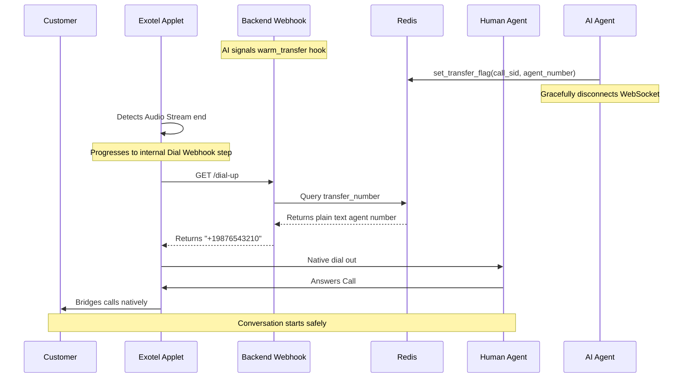

# Exotel Warm Transfer Flow

This document describes the Exotel-specific logic flow for implementing warm transfers in Breeze Buddy.

## 📋 Table of Contents

- [Core Mechanism](#core-mechanism)
- [Flow Steps](#flow-steps)

---

## 🔧 Core Mechanism

Exotel transfers are handled by `ExotelConferenceService` (`app/ai/voice/agents/breeze_buddy/services/telephony/exotel/conference.py`).

Exotel natively operates via a strictly UI-configured Applet flow. In Breeze Buddy, the AI simply sets the transfer context securely in Redis and effectively gracefully disconnects. The Exotel Applet detects the AI disconnection, proceeds explicitly to the next flowchart step natively in Exotel's system (a PASSTHRU/Dial webhook), and successfully dynamically fetches the target agent number via API safely.

---

## 🔄 Flow Steps

**Objective**: Safely transfer a live customer call natively from the AI bot specifically to a human agent via Exotel.



```text
┌─────────────────────────────────────────────┐
│  FLOW: Exotel Warm Transfer                 │
└─────────────────────────────────────────────┘

TRIGGER: AI Function Call (`warm_transfer`) -> `set_transfer_flag` (Redis Cache Database)
INPUT:
  - customer_call_sid: "CA123..."
  - agent_phone_number (Reliably cached securely natively under the precise distinct key `transfer:CA123...`)

STEPS:
  1. Internal Pre-transfer Sync (`ExotelConferenceService`)
     - The codebase inherently returns a dummy "success" payload inside Python dynamically. No outbound discrete API call is effectively made directly. 
     - The AI bot natively dynamically signals correctly a graceful hangup formally perfectly terminating the active distinct WebSocket audio stream.
  
  2. Exotel Applet Flow Natively Resumes
      - Upon AI WebSocket disconnection, the Exotel Call framework automatically progresses to the targeted Applet widget.
      - The configured widget makes an HTTP GET to our `/dial-up` webhook.
`)
